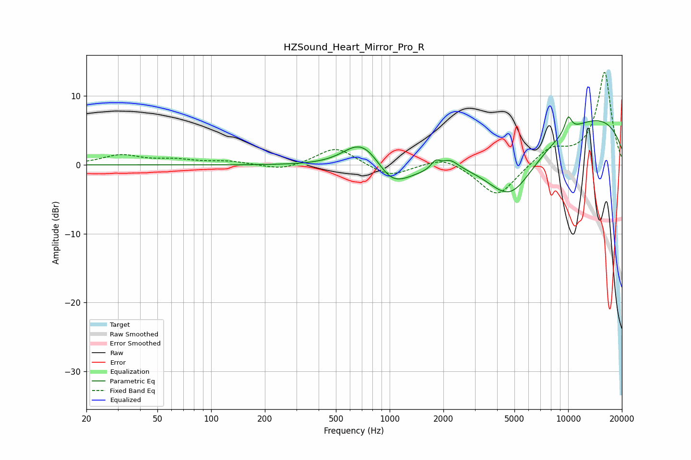

# HZSound_Heart_Mirror_Pro_R
See [usage instructions](https://github.com/jaakkopasanen/AutoEq#usage) for more options and info.

### Parametric EQs
Apply preamp of -7.1 dB when using parametric equalizer.

|   # | Type    |   Fc (Hz) |    Q |   Gain (dB) |
|-----|---------|-----------|------|-------------|
|   1 | Peaking |       674 | 1.49 |         2.8 |
|   2 | Peaking |       844 | 1.21 |         4   |
|   3 | Peaking |       989 | 1.29 |        -5.6 |
|   4 | Peaking |      1810 | 5.43 |         1.3 |
|   5 | Peaking |      1891 | 2.5  |        -0.4 |
|   6 | Peaking |      2165 | 2.94 |         1.5 |
|   7 | Peaking |      3620 | 0.26 |        -4.9 |
|   8 | Peaking |      4739 | 0.96 |        -7.9 |
|   9 | Peaking |      8386 | 0.18 |         9.5 |
|  10 | Peaking |     10000 | 6    |         2.3 |

### Fixed Band EQs
When using fixed band (also called graphic) equalizer, apply preamp of **-13.5 dB** (if available) and set gains manually with these parameters.

|   # | Type    |   Fc (Hz) |    Q |   Gain (dB) |
|-----|---------|-----------|------|-------------|
|   1 | Peaking |        31 | 1.41 |         1.4 |
|   2 | Peaking |        62 | 1.41 |         0.6 |
|   3 | Peaking |       125 | 1.41 |         0.5 |
|   4 | Peaking |       250 | 1.41 |        -0.9 |
|   5 | Peaking |       500 | 1.41 |         2.7 |
|   6 | Peaking |      1000 | 1.41 |        -1.8 |
|   7 | Peaking |      2000 | 1.41 |         1.4 |
|   8 | Peaking |      4000 | 1.41 |        -4.8 |
|   9 | Peaking |      8000 | 1.41 |         2.3 |
|  10 | Peaking |     16000 | 1.41 |        13.5 |

### Graphs

