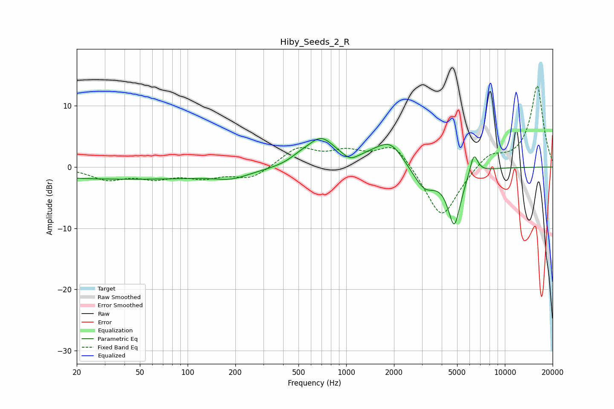

# Hiby_Seeds_2_R
See [usage instructions](https://github.com/jaakkopasanen/AutoEq#usage) for more options and info.

### Parametric EQs
Apply preamp of -4.8 dB when using parametric equalizer.

|   # | Type    |   Fc (Hz) |    Q |   Gain (dB) |
|-----|---------|-----------|------|-------------|
|   1 | Peaking |        41 | 0.18 |        -2   |
|   2 | Peaking |       190 | 1.42 |        -0.9 |
|   3 | Peaking |       508 | 2.36 |         0.7 |
|   4 | Peaking |       693 | 1.58 |         4.5 |
|   5 | Peaking |      1062 | 3.26 |        -0.9 |
|   6 | Peaking |      1507 | 1.48 |         1.3 |
|   7 | Peaking |      1921 | 1.78 |         3.4 |
|   8 | Peaking |      3122 | 1.94 |        -3.6 |
|   9 | Peaking |      4801 | 3.31 |        -9   |
|  10 | Peaking |      6377 | 5.35 |         3.6 |

### Fixed Band EQs
When using fixed band (also called graphic) equalizer, apply preamp of **-13.3 dB** (if available) and set gains manually with these parameters.

|   # | Type    |   Fc (Hz) |    Q |   Gain (dB) |
|-----|---------|-----------|------|-------------|
|   1 | Peaking |        31 | 1.41 |        -1.9 |
|   2 | Peaking |        62 | 1.41 |        -1.6 |
|   3 | Peaking |       125 | 1.41 |        -1.5 |
|   4 | Peaking |       250 | 1.41 |        -1.9 |
|   5 | Peaking |       500 | 1.41 |         3.1 |
|   6 | Peaking |      1000 | 1.41 |         2.1 |
|   7 | Peaking |      2000 | 1.41 |         4.1 |
|   8 | Peaking |      4000 | 1.41 |        -8.8 |
|   9 | Peaking |      8000 | 1.41 |         2.3 |
|  10 | Peaking |     16000 | 1.41 |        13.3 |

### Graphs

