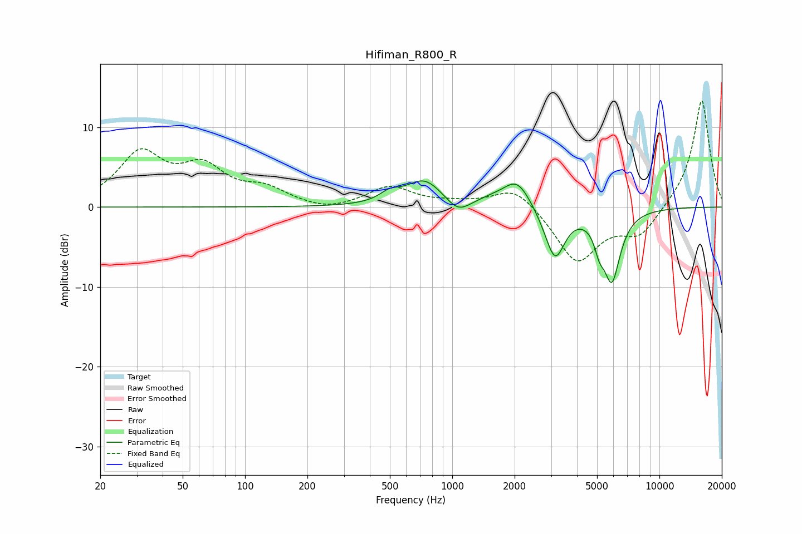

# Hifiman_R800_R
See [usage instructions](https://github.com/jaakkopasanen/AutoEq#usage) for more options and info.

### Parametric EQs
Apply preamp of -3.4 dB when using parametric equalizer.

|   # | Type    |   Fc (Hz) |    Q |   Gain (dB) |
|-----|---------|-----------|------|-------------|
|   1 | Peaking |       499 | 2.91 |         1.1 |
|   2 | Peaking |       732 | 1.6  |         3.3 |
|   3 | Peaking |      1064 | 2.59 |        -1.5 |
|   4 | Peaking |      1104 | 1.92 |        -0.4 |
|   5 | Peaking |      1556 | 1.58 |         0.7 |
|   6 | Peaking |      2060 | 2.14 |         3.4 |
|   7 | Peaking |      2985 | 2.4  |        -1.1 |
|   8 | Peaking |      3146 | 3.06 |        -5.5 |
|   9 | Peaking |      5124 | 6    |        -2.3 |
|  10 | Peaking |      5888 | 3.31 |        -8.7 |

### Fixed Band EQs
When using fixed band (also called graphic) equalizer, apply preamp of **-13.4 dB** (if available) and set gains manually with these parameters.

|   # | Type    |   Fc (Hz) |    Q |   Gain (dB) |
|-----|---------|-----------|------|-------------|
|   1 | Peaking |        31 | 1.41 |         6.4 |
|   2 | Peaking |        62 | 1.41 |         4.4 |
|   3 | Peaking |       125 | 1.41 |         1.9 |
|   4 | Peaking |       250 | 1.41 |        -0.7 |
|   5 | Peaking |       500 | 1.41 |         2.5 |
|   6 | Peaking |      1000 | 1.41 |         0.4 |
|   7 | Peaking |      2000 | 1.41 |         2.8 |
|   8 | Peaking |      4000 | 1.41 |        -6.9 |
|   9 | Peaking |      8000 | 1.41 |        -3.5 |
|  10 | Peaking |     16000 | 1.41 |        13.6 |

### Graphs

