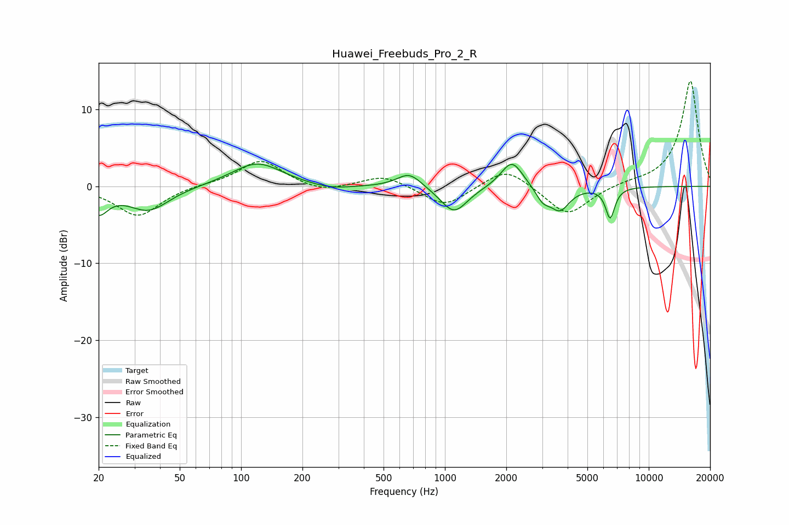

# Huawei_Freebuds_Pro_2_R
See [usage instructions](https://github.com/jaakkopasanen/AutoEq#usage) for more options and info.

### Parametric EQs
Apply preamp of -3.0 dB when using parametric equalizer.

|   # | Type    |   Fc (Hz) |    Q |   Gain (dB) |
|-----|---------|-----------|------|-------------|
|   1 | Peaking |        20 | 3.09 |        -3   |
|   2 | Peaking |        35 | 1.4  |        -3.1 |
|   3 | Peaking |       120 | 1.14 |         3.1 |
|   4 | Peaking |       273 | 1.31 |        -0.6 |
|   5 | Peaking |       669 | 2.34 |         1.9 |
|   6 | Peaking |      1108 | 2.12 |        -3.5 |
|   7 | Peaking |      2131 | 2.62 |         3.6 |
|   8 | Peaking |      3020 | 4.11 |        -1.6 |
|   9 | Peaking |      3661 | 2.94 |        -3   |
|  10 | Peaking |      6468 | 6    |        -4   |

### Fixed Band EQs
When using fixed band (also called graphic) equalizer, apply preamp of **-13.8 dB** (if available) and set gains manually with these parameters.

|   # | Type    |   Fc (Hz) |    Q |   Gain (dB) |
|-----|---------|-----------|------|-------------|
|   1 | Peaking |        31 | 1.41 |        -3.9 |
|   2 | Peaking |        62 | 1.41 |         0.2 |
|   3 | Peaking |       125 | 1.41 |         3.4 |
|   4 | Peaking |       250 | 1.41 |        -0.9 |
|   5 | Peaking |       500 | 1.41 |         1.5 |
|   6 | Peaking |      1000 | 1.41 |        -2.7 |
|   7 | Peaking |      2000 | 1.41 |         2.6 |
|   8 | Peaking |      4000 | 1.41 |        -3.9 |
|   9 | Peaking |      8000 | 1.41 |         0.4 |
|  10 | Peaking |     16000 | 1.41 |        13.8 |

### Graphs

