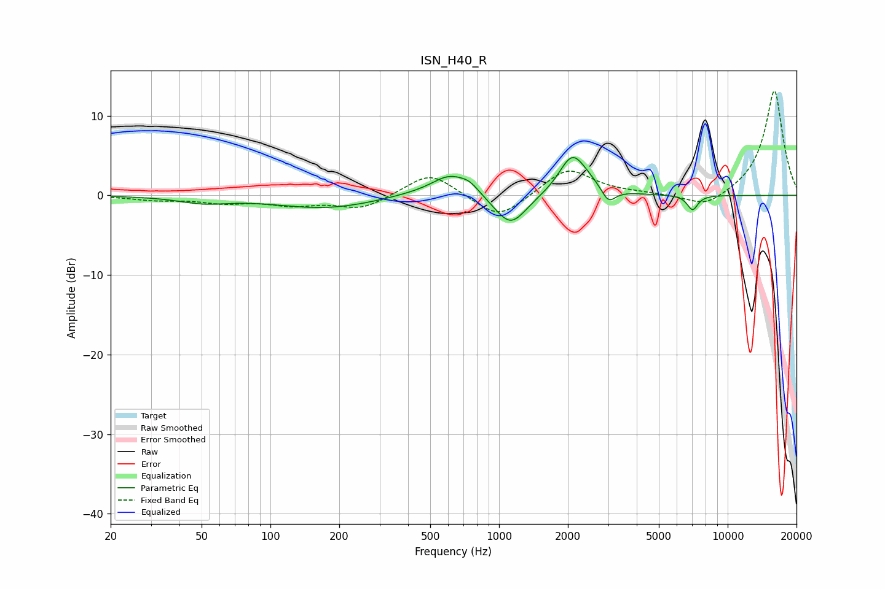

# ISN_H40_R
See [usage instructions](https://github.com/jaakkopasanen/AutoEq#usage) for more options and info.

### Parametric EQs
Apply preamp of -4.9 dB when using parametric equalizer.

|   # | Type    |   Fc (Hz) |    Q |   Gain (dB) |
|-----|---------|-----------|------|-------------|
|   1 | Peaking |        51 | 1.33 |        -0.8 |
|   2 | Peaking |       175 | 0.63 |        -1.6 |
|   3 | Peaking |       410 | 1.09 |         0.3 |
|   4 | Peaking |       608 | 1.74 |         2.6 |
|   5 | Peaking |       745 | 3.27 |         1   |
|   6 | Peaking |      1124 | 2.02 |        -4.1 |
|   7 | Peaking |      2084 | 2.47 |         4.6 |
|   8 | Peaking |      2437 | 1.94 |         0.9 |
|   9 | Peaking |      3008 | 4.57 |        -1.9 |
|  10 | Peaking |      7020 | 5.88 |        -1.9 |

### Fixed Band EQs
When using fixed band (also called graphic) equalizer, apply preamp of **-13.2 dB** (if available) and set gains manually with these parameters.

|   # | Type    |   Fc (Hz) |    Q |   Gain (dB) |
|-----|---------|-----------|------|-------------|
|   1 | Peaking |        31 | 1.41 |        -0.5 |
|   2 | Peaking |        62 | 1.41 |        -0.8 |
|   3 | Peaking |       125 | 1.41 |        -1.1 |
|   4 | Peaking |       250 | 1.41 |        -1.7 |
|   5 | Peaking |       500 | 1.41 |         3   |
|   6 | Peaking |      1000 | 1.41 |        -3.2 |
|   7 | Peaking |      2000 | 1.41 |         3.5 |
|   8 | Peaking |      4000 | 1.41 |         0.2 |
|   9 | Peaking |      8000 | 1.41 |        -1.7 |
|  10 | Peaking |     16000 | 1.41 |        13.3 |

### Graphs

