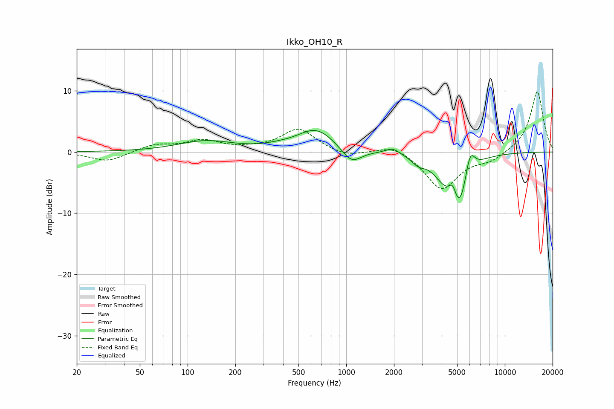

# Ikko_OH10_R
See [usage instructions](https://github.com/jaakkopasanen/AutoEq#usage) for more options and info.

### Parametric EQs
Apply preamp of -3.6 dB when using parametric equalizer.

|   # | Type    |   Fc (Hz) |    Q |   Gain (dB) |
|-----|---------|-----------|------|-------------|
|   1 | Peaking |       130 | 0.81 |         1.7 |
|   2 | Peaking |       373 | 1.48 |         0.3 |
|   3 | Peaking |       646 | 1.19 |         3.7 |
|   4 | Peaking |      1079 | 2.24 |        -2.6 |
|   5 | Peaking |      1963 | 3.26 |         1   |
|   6 | Peaking |      2847 | 3.38 |        -1.2 |
|   7 | Peaking |      4151 | 1.91 |        -3   |
|   8 | Peaking |      4695 | 6    |         2.4 |
|   9 | Peaking |      5172 | 2.49 |        -8   |
|  10 | Peaking |      6028 | 4.53 |         4.3 |

### Fixed Band EQs
When using fixed band (also called graphic) equalizer, apply preamp of **-9.9 dB** (if available) and set gains manually with these parameters.

|   # | Type    |   Fc (Hz) |    Q |   Gain (dB) |
|-----|---------|-----------|------|-------------|
|   1 | Peaking |        31 | 1.41 |        -1.6 |
|   2 | Peaking |        62 | 1.41 |         1.1 |
|   3 | Peaking |       125 | 1.41 |         1.7 |
|   4 | Peaking |       250 | 1.41 |         0.3 |
|   5 | Peaking |       500 | 1.41 |         3.7 |
|   6 | Peaking |      1000 | 1.41 |        -0.9 |
|   7 | Peaking |      2000 | 1.41 |         1.4 |
|   8 | Peaking |      4000 | 1.41 |        -6.1 |
|   9 | Peaking |      8000 | 1.41 |        -1.3 |
|  10 | Peaking |     16000 | 1.41 |        10   |

### Graphs

