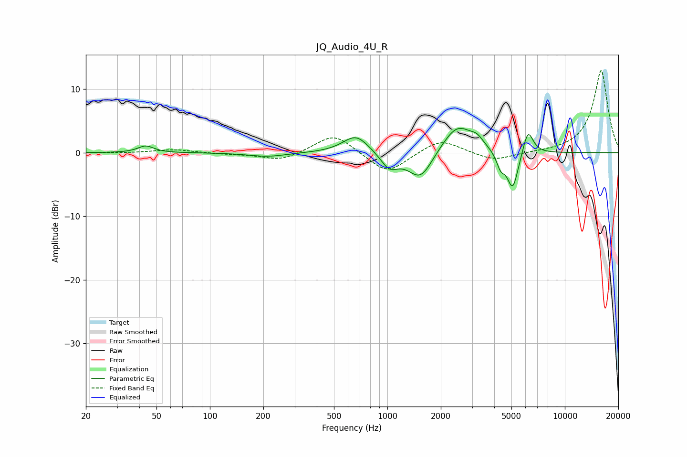

# JQ_Audio_4U_R
See [usage instructions](https://github.com/jaakkopasanen/AutoEq#usage) for more options and info.

### Parametric EQs
Apply preamp of -3.9 dB when using parametric equalizer.

|   # | Type    |   Fc (Hz) |    Q |   Gain (dB) |
|-----|---------|-----------|------|-------------|
|   1 | Peaking |        44 | 3.24 |         1.1 |
|   2 | Peaking |       211 | 1.36 |        -0.6 |
|   3 | Peaking |       665 | 1.94 |         2.9 |
|   4 | Peaking |      1026 | 2.83 |        -2.4 |
|   5 | Peaking |      1537 | 2.01 |        -4.5 |
|   6 | Peaking |      2481 | 1.61 |         4.6 |
|   7 | Peaking |      3204 | 3.96 |         1.1 |
|   8 | Peaking |      4344 | 5.98 |        -2.2 |
|   9 | Peaking |      5083 | 4.31 |        -6.1 |
|  10 | Peaking |      6198 | 4.71 |         4   |

### Fixed Band EQs
When using fixed band (also called graphic) equalizer, apply preamp of **-13.0 dB** (if available) and set gains manually with these parameters.

|   # | Type    |   Fc (Hz) |    Q |   Gain (dB) |
|-----|---------|-----------|------|-------------|
|   1 | Peaking |        31 | 1.41 |        -0.1 |
|   2 | Peaking |        62 | 1.41 |         0.5 |
|   3 | Peaking |       125 | 1.41 |        -0.2 |
|   4 | Peaking |       250 | 1.41 |        -1.3 |
|   5 | Peaking |       500 | 1.41 |         3.1 |
|   6 | Peaking |      1000 | 1.41 |        -3.4 |
|   7 | Peaking |      2000 | 1.41 |         2.3 |
|   8 | Peaking |      4000 | 1.41 |        -1.4 |
|   9 | Peaking |      8000 | 1.41 |         0   |
|  10 | Peaking |     16000 | 1.41 |        13   |

### Graphs

