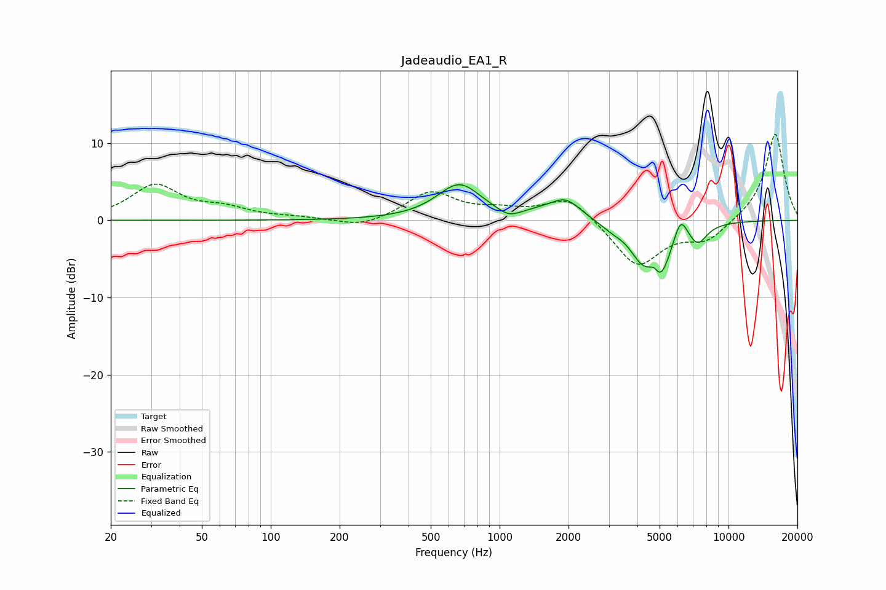

# Jadeaudio_EA1_R
See [usage instructions](https://github.com/jaakkopasanen/AutoEq#usage) for more options and info.

### Parametric EQs
Apply preamp of -4.7 dB when using parametric equalizer.

|   # | Type    |   Fc (Hz) |    Q |   Gain (dB) |
|-----|---------|-----------|------|-------------|
|   1 | Peaking |       666 | 1.46 |         4.6 |
|   2 | Peaking |      1095 | 2.95 |        -1   |
|   3 | Peaking |      1491 | 1.88 |         0.5 |
|   4 | Peaking |      1944 | 2.13 |         2.5 |
|   5 | Peaking |      3131 | 2.61 |        -0.8 |
|   6 | Peaking |      4106 | 2.82 |        -2.7 |
|   7 | Peaking |      4747 | 6    |         1.8 |
|   8 | Peaking |      4964 | 2.68 |        -7.3 |
|   9 | Peaking |      6172 | 4.65 |         3.1 |
|  10 | Peaking |      7343 | 3.41 |        -2.4 |

### Fixed Band EQs
When using fixed band (also called graphic) equalizer, apply preamp of **-11.2 dB** (if available) and set gains manually with these parameters.

|   # | Type    |   Fc (Hz) |    Q |   Gain (dB) |
|-----|---------|-----------|------|-------------|
|   1 | Peaking |        31 | 1.41 |         4.4 |
|   2 | Peaking |        62 | 1.41 |         1.3 |
|   3 | Peaking |       125 | 1.41 |         0.3 |
|   4 | Peaking |       250 | 1.41 |        -1.1 |
|   5 | Peaking |       500 | 1.41 |         3.6 |
|   6 | Peaking |      1000 | 1.41 |         1   |
|   7 | Peaking |      2000 | 1.41 |         3.2 |
|   8 | Peaking |      4000 | 1.41 |        -6   |
|   9 | Peaking |      8000 | 1.41 |        -2.5 |
|  10 | Peaking |     16000 | 1.41 |        11.4 |

### Graphs

