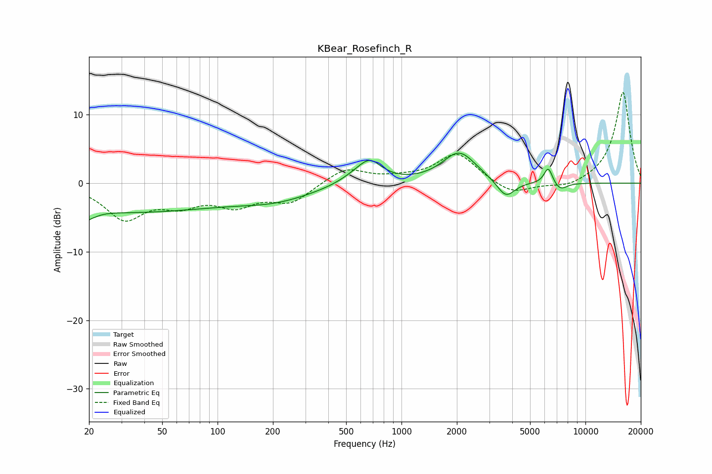

# KBear_Rosefinch_R
See [usage instructions](https://github.com/jaakkopasanen/AutoEq#usage) for more options and info.

### Parametric EQs
Apply preamp of -4.5 dB when using parametric equalizer.

|   # | Type    |   Fc (Hz) |    Q |   Gain (dB) |
|-----|---------|-----------|------|-------------|
|   1 | Peaking |        20 | 5.02 |        -4.6 |
|   2 | Peaking |        20 | 5.89 |         3.2 |
|   3 | Peaking |        31 | 0.25 |        -4.1 |
|   4 | Peaking |       210 | 0.66 |        -1.9 |
|   5 | Peaking |       545 | 1.55 |         0.8 |
|   6 | Peaking |       671 | 2.1  |         3.1 |
|   7 | Peaking |      2061 | 1.53 |         4.5 |
|   8 | Peaking |      3695 | 2.85 |        -2.6 |
|   9 | Peaking |      6282 | 5.98 |         2.4 |
|  10 | Peaking |      7288 | 3.64 |        -1.1 |

### Fixed Band EQs
When using fixed band (also called graphic) equalizer, apply preamp of **-13.3 dB** (if available) and set gains manually with these parameters.

|   # | Type    |   Fc (Hz) |    Q |   Gain (dB) |
|-----|---------|-----------|------|-------------|
|   1 | Peaking |        31 | 1.41 |        -4.9 |
|   2 | Peaking |        62 | 1.41 |        -2.5 |
|   3 | Peaking |       125 | 1.41 |        -2.8 |
|   4 | Peaking |       250 | 1.41 |        -2.6 |
|   5 | Peaking |       500 | 1.41 |         2.3 |
|   6 | Peaking |      1000 | 1.41 |         0.5 |
|   7 | Peaking |      2000 | 1.41 |         4.3 |
|   8 | Peaking |      4000 | 1.41 |        -1.8 |
|   9 | Peaking |      8000 | 1.41 |        -0.8 |
|  10 | Peaking |     16000 | 1.41 |        13.4 |

### Graphs

