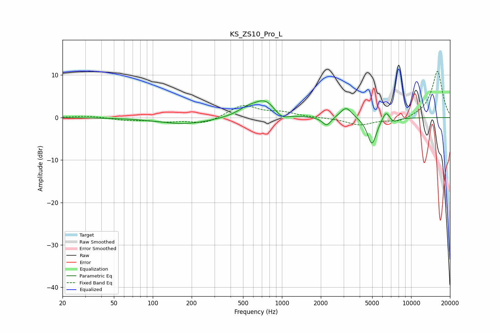

# KS_ZS10_Pro_L
See [usage instructions](https://github.com/jaakkopasanen/AutoEq#usage) for more options and info.

### Parametric EQs
Apply preamp of -4.0 dB when using parametric equalizer.

|   # | Type    |   Fc (Hz) |    Q |   Gain (dB) |
|-----|---------|-----------|------|-------------|
|   1 | Peaking |       178 | 0.69 |        -1.5 |
|   2 | Peaking |       541 | 1.9  |         1.3 |
|   3 | Peaking |       546 | 0.92 |         0.2 |
|   4 | Peaking |       746 | 1.62 |         3.9 |
|   5 | Peaking |       988 | 2.56 |        -1.8 |
|   6 | Peaking |      2220 | 4.15 |        -2.1 |
|   7 | Peaking |      3141 | 3.19 |         2.6 |
|   8 | Peaking |      4979 | 3.88 |        -6.5 |
|   9 | Peaking |      6408 | 4.58 |         2.5 |
|  10 | Peaking |      7225 | 3.52 |        -1.1 |

### Fixed Band EQs
When using fixed band (also called graphic) equalizer, apply preamp of **-11.0 dB** (if available) and set gains manually with these parameters.

|   # | Type    |   Fc (Hz) |    Q |   Gain (dB) |
|-----|---------|-----------|------|-------------|
|   1 | Peaking |        31 | 1.41 |         0.4 |
|   2 | Peaking |        62 | 1.41 |        -0.6 |
|   3 | Peaking |       125 | 1.41 |        -0.8 |
|   4 | Peaking |       250 | 1.41 |        -1.5 |
|   5 | Peaking |       500 | 1.41 |         2.9 |
|   6 | Peaking |      1000 | 1.41 |         1.1 |
|   7 | Peaking |      2000 | 1.41 |        -0   |
|   8 | Peaking |      4000 | 1.41 |        -1.7 |
|   9 | Peaking |      8000 | 1.41 |        -1.1 |
|  10 | Peaking |     16000 | 1.41 |        11   |

### Graphs

