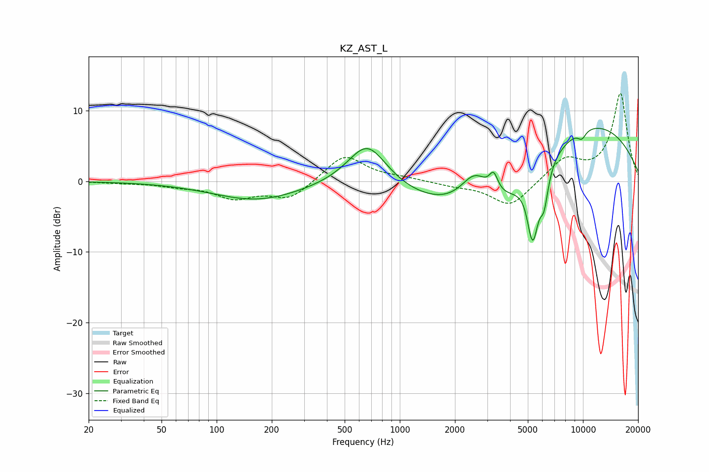

# KZ_AST_L
See [usage instructions](https://github.com/jaakkopasanen/AutoEq#usage) for more options and info.

### Parametric EQs
Apply preamp of -7.6 dB when using parametric equalizer.

|   # | Type    |   Fc (Hz) |    Q |   Gain (dB) |
|-----|---------|-----------|------|-------------|
|   1 | Peaking |       166 | 0.59 |        -2.7 |
|   2 | Peaking |       665 | 1.28 |         6.5 |
|   3 | Peaking |      2567 | 1.79 |         4.7 |
|   4 | Peaking |      3252 | 6    |         2.5 |
|   5 | Peaking |      3662 | 0.39 |       -11.6 |
|   6 | Peaking |      5190 | 5.83 |        -2.5 |
|   7 | Peaking |      5378 | 4.83 |        -6.6 |
|   8 | Peaking |      6130 | 5.85 |        -4.6 |
|   9 | Peaking |      8417 | 0.31 |        12.8 |
|  10 | Peaking |      9861 | 5.47 |        -1.1 |

### Fixed Band EQs
When using fixed band (also called graphic) equalizer, apply preamp of **-12.5 dB** (if available) and set gains manually with these parameters.

|   # | Type    |   Fc (Hz) |    Q |   Gain (dB) |
|-----|---------|-----------|------|-------------|
|   1 | Peaking |        31 | 1.41 |        -0.2 |
|   2 | Peaking |        62 | 1.41 |        -0.6 |
|   3 | Peaking |       125 | 1.41 |        -2.2 |
|   4 | Peaking |       250 | 1.41 |        -2.5 |
|   5 | Peaking |       500 | 1.41 |         3.8 |
|   6 | Peaking |      1000 | 1.41 |         0.4 |
|   7 | Peaking |      2000 | 1.41 |        -0.5 |
|   8 | Peaking |      4000 | 1.41 |        -3.6 |
|   9 | Peaking |      8000 | 1.41 |         3.1 |
|  10 | Peaking |     16000 | 1.41 |        12.4 |

### Graphs

