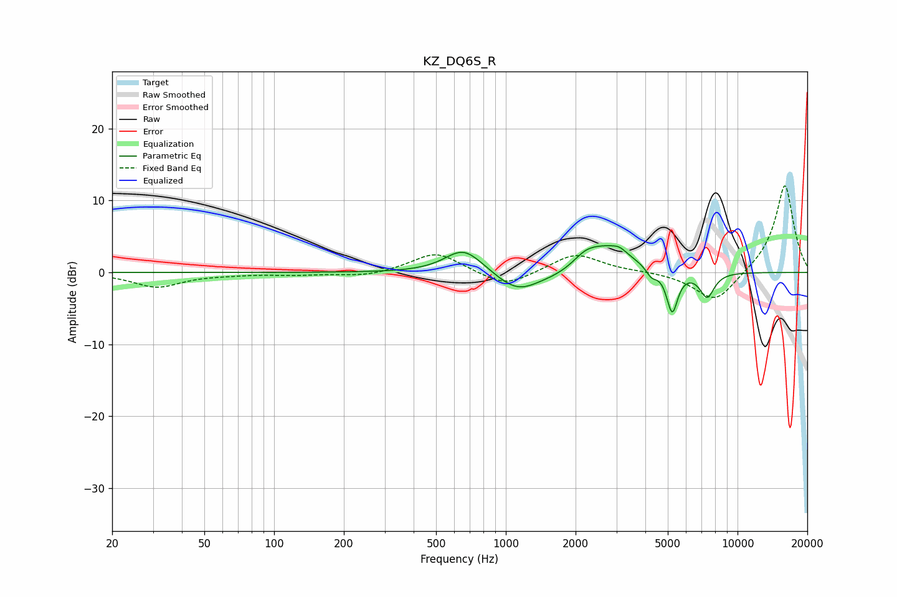

# KZ_DQ6S_R
See [usage instructions](https://github.com/jaakkopasanen/AutoEq#usage) for more options and info.

### Parametric EQs
Apply preamp of -3.8 dB when using parametric equalizer.

|   # | Type    |   Fc (Hz) |    Q |   Gain (dB) |
|-----|---------|-----------|------|-------------|
|   1 | Peaking |       646 | 1.85 |         2.5 |
|   2 | Peaking |       708 | 1.6  |         1.1 |
|   3 | Peaking |      1125 | 1.48 |        -3   |
|   4 | Peaking |      1699 | 1.46 |        -0.8 |
|   5 | Peaking |      2198 | 2.93 |         1   |
|   6 | Peaking |      2695 | 1.27 |         3.7 |
|   7 | Peaking |      3095 | 4.96 |         0.6 |
|   8 | Peaking |      4251 | 5.99 |        -1.3 |
|   9 | Peaking |      5225 | 5.74 |        -5.9 |
|  10 | Peaking |      7387 | 4.24 |        -3.5 |

### Fixed Band EQs
When using fixed band (also called graphic) equalizer, apply preamp of **-12.2 dB** (if available) and set gains manually with these parameters.

|   # | Type    |   Fc (Hz) |    Q |   Gain (dB) |
|-----|---------|-----------|------|-------------|
|   1 | Peaking |        31 | 1.41 |        -2   |
|   2 | Peaking |        62 | 1.41 |        -0.2 |
|   3 | Peaking |       125 | 1.41 |        -0.3 |
|   4 | Peaking |       250 | 1.41 |        -0.6 |
|   5 | Peaking |       500 | 1.41 |         2.9 |
|   6 | Peaking |      1000 | 1.41 |        -2.2 |
|   7 | Peaking |      2000 | 1.41 |         2.7 |
|   8 | Peaking |      4000 | 1.41 |         0.1 |
|   9 | Peaking |      8000 | 1.41 |        -4.3 |
|  10 | Peaking |     16000 | 1.41 |        12.4 |

### Graphs

