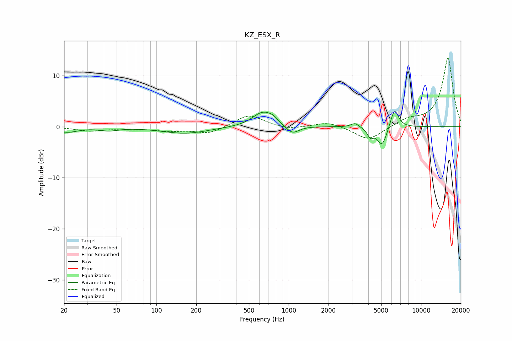

# KZ_ESX_R
See [usage instructions](https://github.com/jaakkopasanen/AutoEq#usage) for more options and info.

### Parametric EQs
Apply preamp of -3.1 dB when using parametric equalizer.

|   # | Type    |   Fc (Hz) |    Q |   Gain (dB) |
|-----|---------|-----------|------|-------------|
|   1 | Peaking |        21 | 1.8  |        -1   |
|   2 | Peaking |        43 | 2.06 |        -0.6 |
|   3 | Peaking |       165 | 0.81 |        -1.3 |
|   4 | Peaking |       639 | 1.82 |         2.9 |
|   5 | Peaking |       763 | 3.94 |         0.7 |
|   6 | Peaking |      1064 | 2.81 |        -1.7 |
|   7 | Peaking |      3174 | 4.73 |         0.9 |
|   8 | Peaking |      4150 | 6    |        -1.6 |
|   9 | Peaking |      5084 | 3.77 |        -3.8 |
|  10 | Peaking |      6302 | 4.52 |         3.9 |

### Fixed Band EQs
When using fixed band (also called graphic) equalizer, apply preamp of **-13.5 dB** (if available) and set gains manually with these parameters.

|   # | Type    |   Fc (Hz) |    Q |   Gain (dB) |
|-----|---------|-----------|------|-------------|
|   1 | Peaking |        31 | 1.41 |        -0.8 |
|   2 | Peaking |        62 | 1.41 |        -0.4 |
|   3 | Peaking |       125 | 1.41 |        -0.7 |
|   4 | Peaking |       250 | 1.41 |        -1.4 |
|   5 | Peaking |       500 | 1.41 |         2.4 |
|   6 | Peaking |      1000 | 1.41 |        -0.6 |
|   7 | Peaking |      2000 | 1.41 |         1   |
|   8 | Peaking |      4000 | 1.41 |        -2.8 |
|   9 | Peaking |      8000 | 1.41 |         1.3 |
|  10 | Peaking |     16000 | 1.41 |        13.5 |

### Graphs

