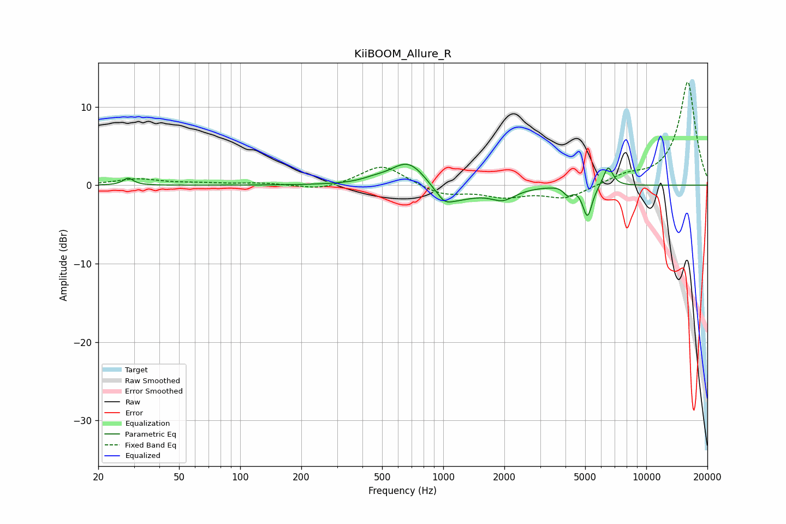

# KiiBOOM_Allure_R
See [usage instructions](https://github.com/jaakkopasanen/AutoEq#usage) for more options and info.

### Parametric EQs
Apply preamp of -2.8 dB when using parametric equalizer.

|   # | Type    |   Fc (Hz) |    Q |   Gain (dB) |
|-----|---------|-----------|------|-------------|
|   1 | Peaking |        28 | 5.97 |         0.9 |
|   2 | Peaking |       453 | 2.7  |         0.3 |
|   3 | Peaking |       679 | 1.55 |         3.6 |
|   4 | Peaking |      1014 | 3.77 |        -1.1 |
|   5 | Peaking |      1099 | 1.22 |        -2.3 |
|   6 | Peaking |      1969 | 2.32 |        -1.5 |
|   7 | Peaking |      4079 | 2.8  |         0.5 |
|   8 | Peaking |      4106 | 6    |        -1.4 |
|   9 | Peaking |      5133 | 6    |        -4.1 |
|  10 | Peaking |      6487 | 5.88 |         2.6 |

### Fixed Band EQs
When using fixed band (also called graphic) equalizer, apply preamp of **-13.2 dB** (if available) and set gains manually with these parameters.

|   # | Type    |   Fc (Hz) |    Q |   Gain (dB) |
|-----|---------|-----------|------|-------------|
|   1 | Peaking |        31 | 1.41 |         0.8 |
|   2 | Peaking |        62 | 1.41 |         0.2 |
|   3 | Peaking |       125 | 1.41 |         0.3 |
|   4 | Peaking |       250 | 1.41 |        -0.7 |
|   5 | Peaking |       500 | 1.41 |         2.7 |
|   6 | Peaking |      1000 | 1.41 |        -1.3 |
|   7 | Peaking |      2000 | 1.41 |        -1.3 |
|   8 | Peaking |      4000 | 1.41 |        -1.7 |
|   9 | Peaking |      8000 | 1.41 |         1.1 |
|  10 | Peaking |     16000 | 1.41 |        13.2 |

### Graphs

