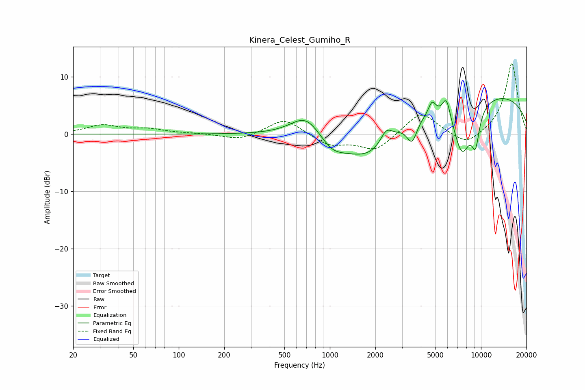

# Kinera_Celest_Gumiho_R
See [usage instructions](https://github.com/jaakkopasanen/AutoEq#usage) for more options and info.

### Parametric EQs
Apply preamp of -6.3 dB when using parametric equalizer.

|   # | Type    |   Fc (Hz) |    Q |   Gain (dB) |
|-----|---------|-----------|------|-------------|
|   1 | Peaking |       698 | 1.39 |         4   |
|   2 | Peaking |      1034 | 1.64 |        -2.5 |
|   3 | Peaking |      1826 | 0.81 |        -6   |
|   4 | Peaking |      2361 | 3.73 |         2.3 |
|   5 | Peaking |      3496 | 4.19 |        -3.7 |
|   6 | Peaking |      4745 | 5.84 |         2.2 |
|   7 | Peaking |      5910 | 5.06 |         3.8 |
|   8 | Peaking |      7490 | 2.12 |        -9.4 |
|   9 | Peaking |      9196 | 4.82 |        -5.6 |
|  10 | Peaking |      9756 | 0.21 |         7.4 |

### Fixed Band EQs
When using fixed band (also called graphic) equalizer, apply preamp of **-12.4 dB** (if available) and set gains manually with these parameters.

|   # | Type    |   Fc (Hz) |    Q |   Gain (dB) |
|-----|---------|-----------|------|-------------|
|   1 | Peaking |        31 | 1.41 |         1.5 |
|   2 | Peaking |        62 | 1.41 |         0.8 |
|   3 | Peaking |       125 | 1.41 |         0.1 |
|   4 | Peaking |       250 | 1.41 |        -1.1 |
|   5 | Peaking |       500 | 1.41 |         2.8 |
|   6 | Peaking |      1000 | 1.41 |        -1.9 |
|   7 | Peaking |      2000 | 1.41 |        -2.9 |
|   8 | Peaking |      4000 | 1.41 |         4   |
|   9 | Peaking |      8000 | 1.41 |        -2.3 |
|  10 | Peaking |     16000 | 1.41 |        12.5 |

### Graphs

