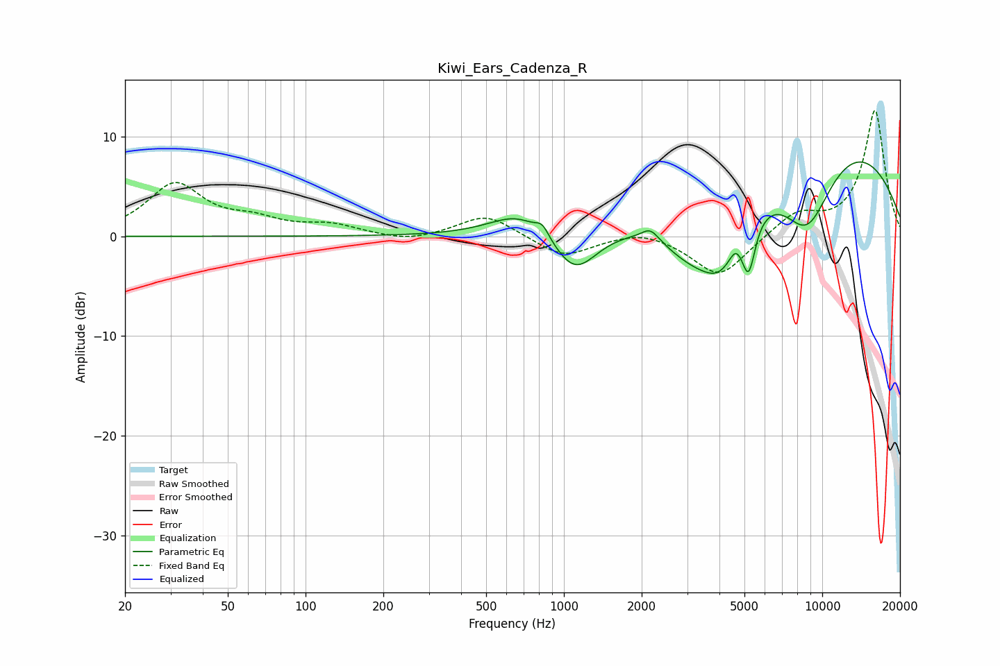

# Kiwi_Ears_Cadenza_R
See [usage instructions](https://github.com/jaakkopasanen/AutoEq#usage) for more options and info.

### Parametric EQs
Apply preamp of -7.5 dB when using parametric equalizer.

|   # | Type    |   Fc (Hz) |    Q |   Gain (dB) |
|-----|---------|-----------|------|-------------|
|   1 | Peaking |       668 | 1.28 |         2.3 |
|   2 | Peaking |       825 | 5.62 |         1.1 |
|   3 | Peaking |      1104 | 1.63 |        -4.5 |
|   4 | Peaking |      2163 | 4.24 |         1.2 |
|   5 | Peaking |      3138 | 1.05 |        -5.3 |
|   6 | Peaking |      4073 | 1.65 |        -5.5 |
|   7 | Peaking |      4614 | 5.94 |         1   |
|   8 | Peaking |      5192 | 5.42 |        -5   |
|   9 | Peaking |      8730 | 1.05 |       -10.6 |
|  10 | Peaking |      9303 | 0.3  |        13   |

### Fixed Band EQs
When using fixed band (also called graphic) equalizer, apply preamp of **-12.7 dB** (if available) and set gains manually with these parameters.

|   # | Type    |   Fc (Hz) |    Q |   Gain (dB) |
|-----|---------|-----------|------|-------------|
|   1 | Peaking |        31 | 1.41 |         5.1 |
|   2 | Peaking |        62 | 1.41 |         1.3 |
|   3 | Peaking |       125 | 1.41 |         1   |
|   4 | Peaking |       250 | 1.41 |        -0.6 |
|   5 | Peaking |       500 | 1.41 |         2.2 |
|   6 | Peaking |      1000 | 1.41 |        -2.1 |
|   7 | Peaking |      2000 | 1.41 |         0.8 |
|   8 | Peaking |      4000 | 1.41 |        -4.2 |
|   9 | Peaking |      8000 | 1.41 |         2.2 |
|  10 | Peaking |     16000 | 1.41 |        12.6 |

### Graphs

