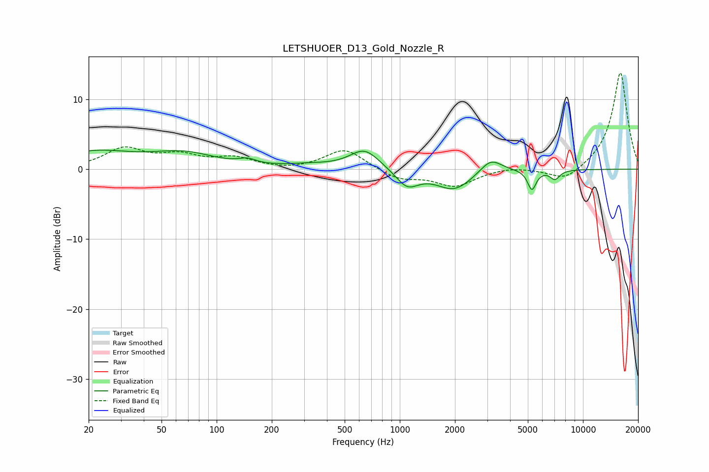

# LETSHUOER_D13_Gold_Nozzle_R
See [usage instructions](https://github.com/jaakkopasanen/AutoEq#usage) for more options and info.

### Parametric EQs
Apply preamp of -2.8 dB when using parametric equalizer.

|   # | Type    |   Fc (Hz) |    Q |   Gain (dB) |
|-----|---------|-----------|------|-------------|
|   1 | Peaking |        21 | 0.66 |         2.4 |
|   2 | Peaking |        66 | 0.82 |         2   |
|   3 | Peaking |       148 | 2.98 |         0.7 |
|   4 | Peaking |       321 | 1.07 |         0.5 |
|   5 | Peaking |       642 | 1.74 |         2.9 |
|   6 | Peaking |      1098 | 2.29 |        -2.5 |
|   7 | Peaking |      1984 | 1.42 |        -2.9 |
|   8 | Peaking |      3139 | 2.37 |         2.1 |
|   9 | Peaking |      5263 | 6    |        -2.8 |
|  10 | Peaking |      7028 | 5.19 |        -1.3 |

### Fixed Band EQs
When using fixed band (also called graphic) equalizer, apply preamp of **-13.9 dB** (if available) and set gains manually with these parameters.

|   # | Type    |   Fc (Hz) |    Q |   Gain (dB) |
|-----|---------|-----------|------|-------------|
|   1 | Peaking |        31 | 1.41 |         2.8 |
|   2 | Peaking |        62 | 1.41 |         1.7 |
|   3 | Peaking |       125 | 1.41 |         1.4 |
|   4 | Peaking |       250 | 1.41 |        -0.2 |
|   5 | Peaking |       500 | 1.41 |         2.9 |
|   6 | Peaking |      1000 | 1.41 |        -1.4 |
|   7 | Peaking |      2000 | 1.41 |        -2.3 |
|   8 | Peaking |      4000 | 1.41 |         0.4 |
|   9 | Peaking |      8000 | 1.41 |        -1.9 |
|  10 | Peaking |     16000 | 1.41 |        14   |

### Graphs

