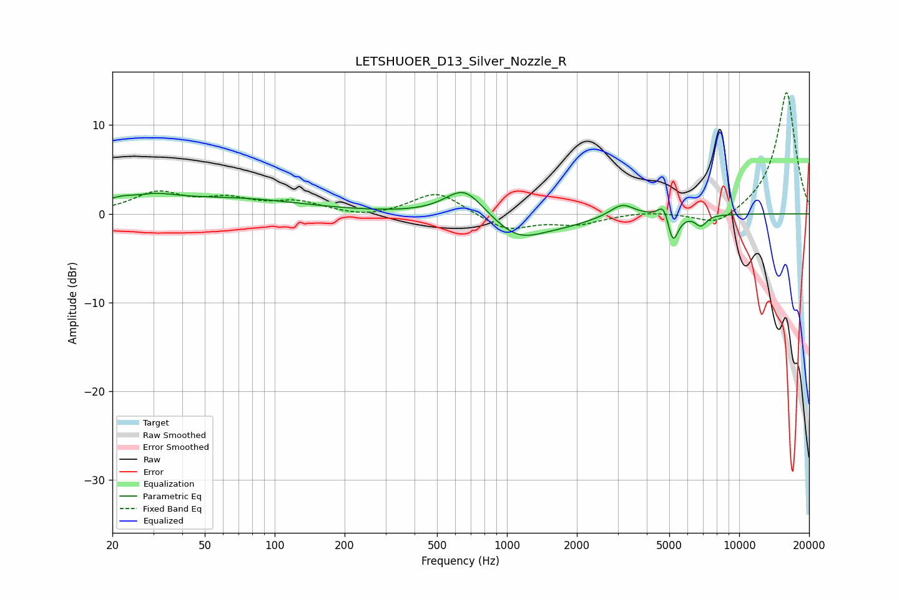

# LETSHUOER_D13_Silver_Nozzle_R
See [usage instructions](https://github.com/jaakkopasanen/AutoEq#usage) for more options and info.

### Parametric EQs
Apply preamp of -2.5 dB when using parametric equalizer.

|   # | Type    |   Fc (Hz) |    Q |   Gain (dB) |
|-----|---------|-----------|------|-------------|
|   1 | Peaking |        26 | 1.23 |         2.2 |
|   2 | Peaking |        26 | 2.44 |        -0.8 |
|   3 | Peaking |        68 | 0.47 |         1.6 |
|   4 | Peaking |       656 | 1.72 |         3.2 |
|   5 | Peaking |      1118 | 1.3  |        -2.6 |
|   6 | Peaking |      1746 | 1.09 |        -0.9 |
|   7 | Peaking |      3136 | 2.75 |         1.4 |
|   8 | Peaking |      4747 | 6    |         1.8 |
|   9 | Peaking |      5176 | 6    |        -3.5 |
|  10 | Peaking |      6843 | 5.55 |        -1.2 |

### Fixed Band EQs
When using fixed band (also called graphic) equalizer, apply preamp of **-13.8 dB** (if available) and set gains manually with these parameters.

|   # | Type    |   Fc (Hz) |    Q |   Gain (dB) |
|-----|---------|-----------|------|-------------|
|   1 | Peaking |        31 | 1.41 |         2.3 |
|   2 | Peaking |        62 | 1.41 |         1.4 |
|   3 | Peaking |       125 | 1.41 |         1.2 |
|   4 | Peaking |       250 | 1.41 |        -0.5 |
|   5 | Peaking |       500 | 1.41 |         2.6 |
|   6 | Peaking |      1000 | 1.41 |        -1.9 |
|   7 | Peaking |      2000 | 1.41 |        -1.1 |
|   8 | Peaking |      4000 | 1.41 |         0.3 |
|   9 | Peaking |      8000 | 1.41 |        -1.6 |
|  10 | Peaking |     16000 | 1.41 |        13.8 |

### Graphs

