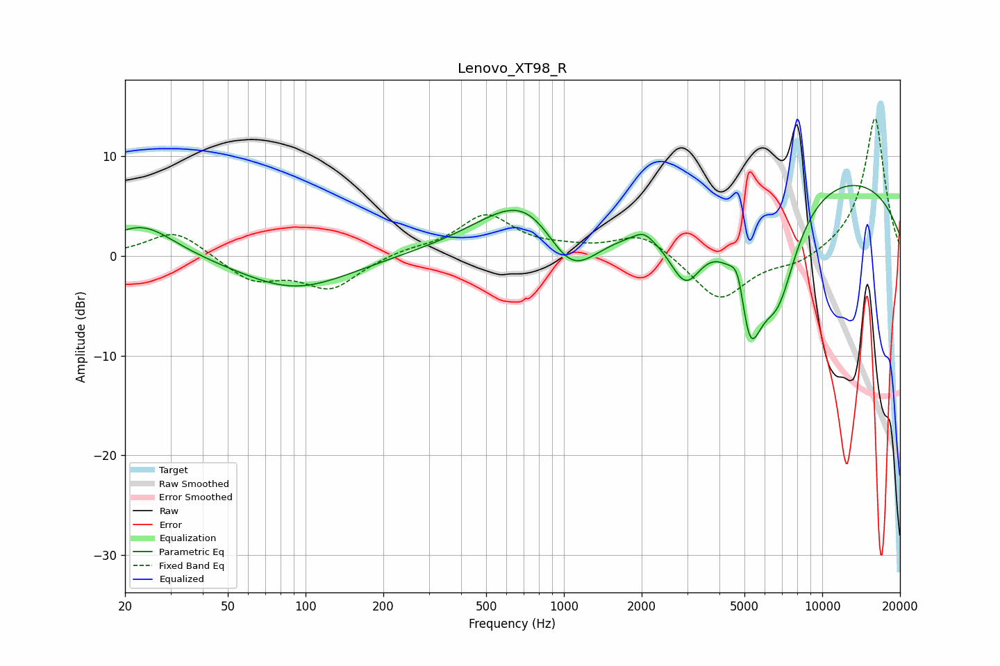

# Lenovo_XT98_R
See [usage instructions](https://github.com/jaakkopasanen/AutoEq#usage) for more options and info.

### Parametric EQs
Apply preamp of -7.2 dB when using parametric equalizer.

|   # | Type    |   Fc (Hz) |    Q |   Gain (dB) |
|-----|---------|-----------|------|-------------|
|   1 | Peaking |        23 | 1.12 |         3.3 |
|   2 | Peaking |        91 | 0.67 |        -3.4 |
|   3 | Peaking |       745 | 0.77 |         7.4 |
|   4 | Peaking |      1057 | 1.19 |        -7   |
|   5 | Peaking |      2037 | 3.97 |         0.8 |
|   6 | Peaking |      2960 | 2.05 |        -6.1 |
|   7 | Peaking |      4740 | 4.61 |         4.1 |
|   8 | Peaking |      5216 | 2.38 |       -12.7 |
|   9 | Peaking |      6764 | 1.73 |        -8.8 |
|  10 | Peaking |      9215 | 0.21 |         8.6 |

### Fixed Band EQs
When using fixed band (also called graphic) equalizer, apply preamp of **-13.9 dB** (if available) and set gains manually with these parameters.

|   # | Type    |   Fc (Hz) |    Q |   Gain (dB) |
|-----|---------|-----------|------|-------------|
|   1 | Peaking |        31 | 1.41 |         2.7 |
|   2 | Peaking |        62 | 1.41 |        -2.4 |
|   3 | Peaking |       125 | 1.41 |        -3.2 |
|   4 | Peaking |       250 | 1.41 |         0.6 |
|   5 | Peaking |       500 | 1.41 |         4   |
|   6 | Peaking |      1000 | 1.41 |         0.5 |
|   7 | Peaking |      2000 | 1.41 |         2.3 |
|   8 | Peaking |      4000 | 1.41 |        -4.6 |
|   9 | Peaking |      8000 | 1.41 |        -1   |
|  10 | Peaking |     16000 | 1.41 |        14   |

### Graphs

