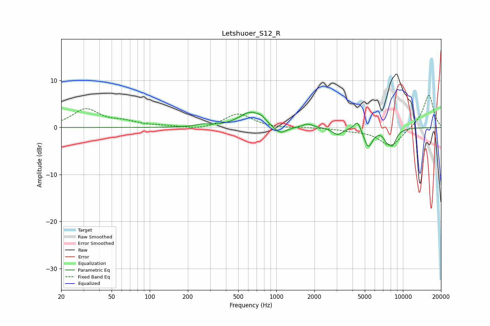

# Letshuoer_S12_R
See [usage instructions](https://github.com/jaakkopasanen/AutoEq#usage) for more options and info.

### Parametric EQs
Apply preamp of -3.3 dB when using parametric equalizer.

|   # | Type    |   Fc (Hz) |    Q |   Gain (dB) |
|-----|---------|-----------|------|-------------|
|   1 | Peaking |       265 | 2.45 |         0.5 |
|   2 | Peaking |       632 | 1.56 |         3.3 |
|   3 | Peaking |       764 | 5.68 |         0.5 |
|   4 | Peaking |      1069 | 2.73 |        -1.8 |
|   5 | Peaking |      1771 | 3.62 |         0.8 |
|   6 | Peaking |      3047 | 3.62 |        -1.5 |
|   7 | Peaking |      4379 | 5.28 |         2.2 |
|   8 | Peaking |      5327 | 4.07 |        -4   |
|   9 | Peaking |      7399 | 6    |        -1.3 |
|  10 | Peaking |      8240 | 3.99 |        -3.4 |

### Fixed Band EQs
When using fixed band (also called graphic) equalizer, apply preamp of **-6.9 dB** (if available) and set gains manually with these parameters.

|   # | Type    |   Fc (Hz) |    Q |   Gain (dB) |
|-----|---------|-----------|------|-------------|
|   1 | Peaking |        31 | 1.41 |         3.8 |
|   2 | Peaking |        62 | 1.41 |         1   |
|   3 | Peaking |       125 | 1.41 |         0.2 |
|   4 | Peaking |       250 | 1.41 |        -0.5 |
|   5 | Peaking |       500 | 1.41 |         3   |
|   6 | Peaking |      1000 | 1.41 |        -0.2 |
|   7 | Peaking |      2000 | 1.41 |        -0   |
|   8 | Peaking |      4000 | 1.41 |        -0.5 |
|   9 | Peaking |      8000 | 1.41 |        -4   |
|  10 | Peaking |     16000 | 1.41 |         7.1 |

### Graphs

