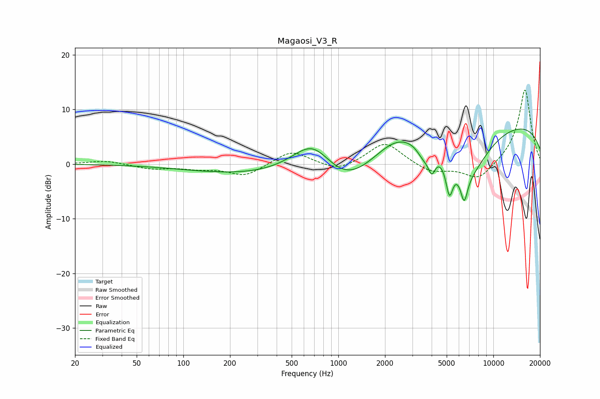

# Magaosi_V3_R
See [usage instructions](https://github.com/jaakkopasanen/AutoEq#usage) for more options and info.

### Parametric EQs
Apply preamp of -6.5 dB when using parametric equalizer.

|   # | Type    |   Fc (Hz) |    Q |   Gain (dB) |
|-----|---------|-----------|------|-------------|
|   1 | Peaking |       488 | 0.22 |        -2.3 |
|   2 | Peaking |       687 | 0.98 |         7.6 |
|   3 | Peaking |      1095 | 0.72 |        -5.4 |
|   4 | Peaking |      2326 | 0.92 |         3.5 |
|   5 | Peaking |      3529 | 3.37 |        -2.1 |
|   6 | Peaking |      4006 | 5.92 |        -3.5 |
|   7 | Peaking |      5206 | 6    |        -5.9 |
|   8 | Peaking |      6483 | 6    |        -4.9 |
|   9 | Peaking |      6884 | 0.98 |        -9.1 |
|  10 | Peaking |     10000 | 0.18 |         8.2 |

### Fixed Band EQs
When using fixed band (also called graphic) equalizer, apply preamp of **-13.7 dB** (if available) and set gains manually with these parameters.

|   # | Type    |   Fc (Hz) |    Q |   Gain (dB) |
|-----|---------|-----------|------|-------------|
|   1 | Peaking |        31 | 1.41 |         0.7 |
|   2 | Peaking |        62 | 1.41 |        -0.8 |
|   3 | Peaking |       125 | 1.41 |        -0.7 |
|   4 | Peaking |       250 | 1.41 |        -2.2 |
|   5 | Peaking |       500 | 1.41 |         2.6 |
|   6 | Peaking |      1000 | 1.41 |        -1.5 |
|   7 | Peaking |      2000 | 1.41 |         4.1 |
|   8 | Peaking |      4000 | 1.41 |        -1.6 |
|   9 | Peaking |      8000 | 1.41 |        -3.1 |
|  10 | Peaking |     16000 | 1.41 |        13.8 |

### Graphs

