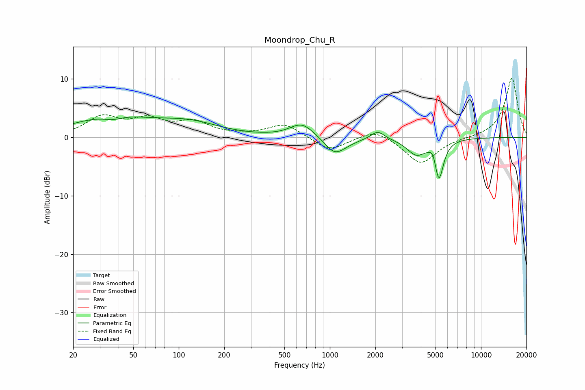

# Moondrop_Chu_R
See [usage instructions](https://github.com/jaakkopasanen/AutoEq#usage) for more options and info.

### Parametric EQs
Apply preamp of -3.6 dB when using parametric equalizer.

|   # | Type    |   Fc (Hz) |    Q |   Gain (dB) |
|-----|---------|-----------|------|-------------|
|   1 | Peaking |        36 | 0.57 |         3.5 |
|   2 | Peaking |        37 | 2.02 |        -0.9 |
|   3 | Peaking |       117 | 0.7  |         2.2 |
|   4 | Peaking |       653 | 1.79 |         2.4 |
|   5 | Peaking |      1069 | 2.22 |        -2.5 |
|   6 | Peaking |      1231 | 1.68 |        -0.7 |
|   7 | Peaking |      2072 | 3.23 |         1.5 |
|   8 | Peaking |      3725 | 2.28 |        -2.7 |
|   9 | Peaking |      4833 | 6    |         1.7 |
|  10 | Peaking |      5259 | 4.66 |        -7   |

### Fixed Band EQs
When using fixed band (also called graphic) equalizer, apply preamp of **-10.2 dB** (if available) and set gains manually with these parameters.

|   # | Type    |   Fc (Hz) |    Q |   Gain (dB) |
|-----|---------|-----------|------|-------------|
|   1 | Peaking |        31 | 1.41 |         3.3 |
|   2 | Peaking |        62 | 1.41 |         2.7 |
|   3 | Peaking |       125 | 1.41 |         2.4 |
|   4 | Peaking |       250 | 1.41 |         0.2 |
|   5 | Peaking |       500 | 1.41 |         2.3 |
|   6 | Peaking |      1000 | 1.41 |        -2.4 |
|   7 | Peaking |      2000 | 1.41 |         1.6 |
|   8 | Peaking |      4000 | 1.41 |        -4.6 |
|   9 | Peaking |      8000 | 1.41 |        -0   |
|  10 | Peaking |     16000 | 1.41 |        10.2 |

### Graphs

