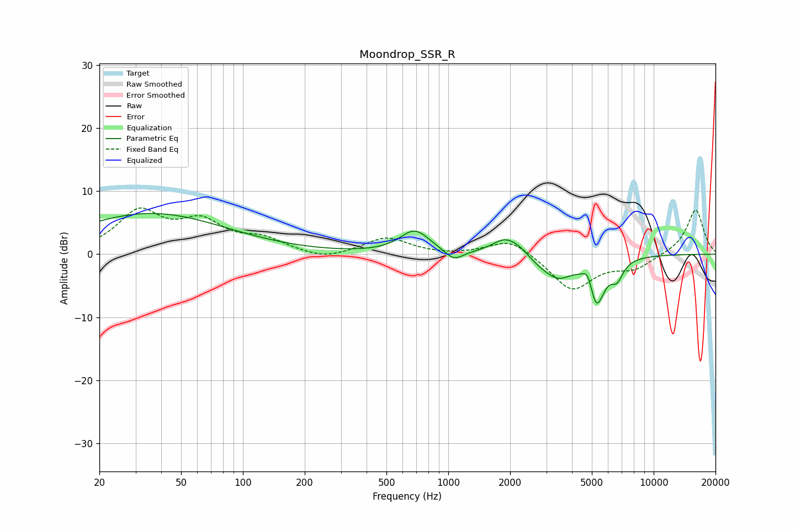

# Moondrop_SSR_R
See [usage instructions](https://github.com/jaakkopasanen/AutoEq#usage) for more options and info.

### Parametric EQs
Apply preamp of -6.6 dB when using parametric equalizer.

|   # | Type    |   Fc (Hz) |    Q |   Gain (dB) |
|-----|---------|-----------|------|-------------|
|   1 | Peaking |        36 | 0.38 |         6.5 |
|   2 | Peaking |       687 | 1.94 |         3.7 |
|   3 | Peaking |      1066 | 3.21 |        -1.7 |
|   4 | Peaking |      1897 | 2.18 |         2.6 |
|   5 | Peaking |      2236 | 3.29 |         0.7 |
|   6 | Peaking |      2849 | 2.03 |        -1.1 |
|   7 | Peaking |      3456 | 2.12 |        -2.9 |
|   8 | Peaking |      4792 | 5.78 |         2.6 |
|   9 | Peaking |      5253 | 3.46 |        -7.8 |
|  10 | Peaking |      6629 | 4.57 |        -2.6 |

### Fixed Band EQs
When using fixed band (also called graphic) equalizer, apply preamp of **-7.4 dB** (if available) and set gains manually with these parameters.

|   # | Type    |   Fc (Hz) |    Q |   Gain (dB) |
|-----|---------|-----------|------|-------------|
|   1 | Peaking |        31 | 1.41 |         6.4 |
|   2 | Peaking |        62 | 1.41 |         4.5 |
|   3 | Peaking |       125 | 1.41 |         2.1 |
|   4 | Peaking |       250 | 1.41 |        -1.1 |
|   5 | Peaking |       500 | 1.41 |         2.6 |
|   6 | Peaking |      1000 | 1.41 |        -0.2 |
|   7 | Peaking |      2000 | 1.41 |         2.6 |
|   8 | Peaking |      4000 | 1.41 |        -5.7 |
|   9 | Peaking |      8000 | 1.41 |        -2.1 |
|  10 | Peaking |     16000 | 1.41 |         7.2 |

### Graphs

