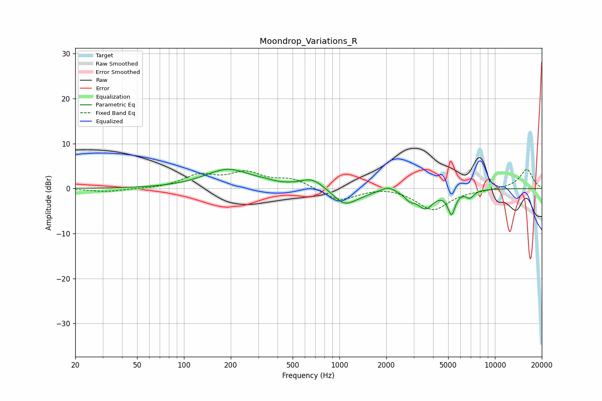

# Moondrop_Variations_R
See [usage instructions](https://github.com/jaakkopasanen/AutoEq#usage) for more options and info.

### Parametric EQs
Apply preamp of -4.4 dB when using parametric equalizer.

|   # | Type    |   Fc (Hz) |    Q |   Gain (dB) |
|-----|---------|-----------|------|-------------|
|   1 | Peaking |       192 | 0.93 |         4.2 |
|   2 | Peaking |       327 | 2.94 |         0.3 |
|   3 | Peaking |       666 | 1.9  |         2.2 |
|   4 | Peaking |      1080 | 1.93 |        -3.5 |
|   5 | Peaking |      1382 | 1.7  |        -0.6 |
|   6 | Peaking |      2048 | 3.36 |         1.1 |
|   7 | Peaking |      2832 | 4.14 |        -1.5 |
|   8 | Peaking |      3575 | 2.74 |        -4   |
|   9 | Peaking |      5254 | 5.88 |        -5   |
|  10 | Peaking |      6900 | 5.15 |        -1.6 |

### Fixed Band EQs
When using fixed band (also called graphic) equalizer, apply preamp of **-4.3 dB** (if available) and set gains manually with these parameters.

|   # | Type    |   Fc (Hz) |    Q |   Gain (dB) |
|-----|---------|-----------|------|-------------|
|   1 | Peaking |        31 | 1.41 |        -0.7 |
|   2 | Peaking |        62 | 1.41 |        -0.1 |
|   3 | Peaking |       125 | 1.41 |         2.7 |
|   4 | Peaking |       250 | 1.41 |         3.2 |
|   5 | Peaking |       500 | 1.41 |         2   |
|   6 | Peaking |      1000 | 1.41 |        -2.8 |
|   7 | Peaking |      2000 | 1.41 |         0.6 |
|   8 | Peaking |      4000 | 1.41 |        -4.7 |
|   9 | Peaking |      8000 | 1.41 |        -0.3 |
|  10 | Peaking |     16000 | 1.41 |         4.3 |

### Graphs

