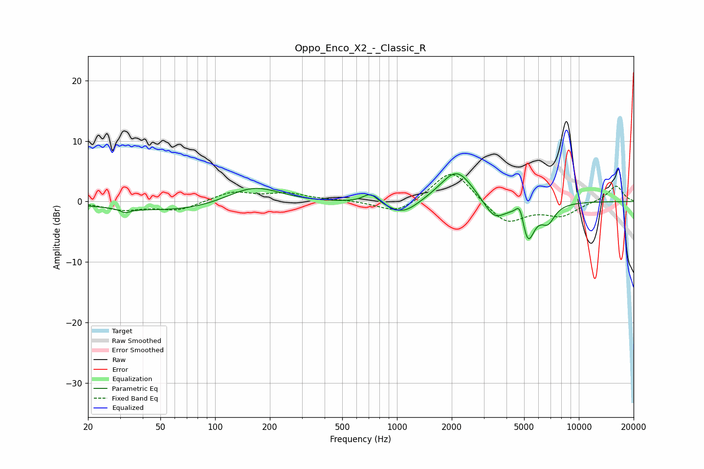

# Oppo_Enco_X2_-_Classic_R
See [usage instructions](https://github.com/jaakkopasanen/AutoEq#usage) for more options and info.

### Parametric EQs
Apply preamp of -4.7 dB when using parametric equalizer.

|   # | Type    |   Fc (Hz) |    Q |   Gain (dB) |
|-----|---------|-----------|------|-------------|
|   1 | Peaking |        32 | 5.03 |        -0.7 |
|   2 | Peaking |        81 | 0.32 |        -2   |
|   3 | Peaking |       162 | 0.89 |         3.7 |
|   4 | Peaking |       713 | 3.54 |         1.6 |
|   5 | Peaking |      1081 | 1.64 |        -2.4 |
|   6 | Peaking |      2130 | 1.56 |         5.5 |
|   7 | Peaking |      3433 | 2.33 |        -3.3 |
|   8 | Peaking |      4751 | 5.97 |         3.2 |
|   9 | Peaking |      5229 | 3.73 |        -6.6 |
|  10 | Peaking |      6758 | 3.53 |        -2.8 |

### Fixed Band EQs
When using fixed band (also called graphic) equalizer, apply preamp of **-4.6 dB** (if available) and set gains manually with these parameters.

|   # | Type    |   Fc (Hz) |    Q |   Gain (dB) |
|-----|---------|-----------|------|-------------|
|   1 | Peaking |        31 | 1.41 |        -1.3 |
|   2 | Peaking |        62 | 1.41 |        -1.4 |
|   3 | Peaking |       125 | 1.41 |         1.6 |
|   4 | Peaking |       250 | 1.41 |         1.2 |
|   5 | Peaking |       500 | 1.41 |         0.2 |
|   6 | Peaking |      1000 | 1.41 |        -2.2 |
|   7 | Peaking |      2000 | 1.41 |         5.6 |
|   8 | Peaking |      4000 | 1.41 |        -3.8 |
|   9 | Peaking |      8000 | 1.41 |        -2.2 |
|  10 | Peaking |     16000 | 1.41 |         2.7 |

### Graphs

