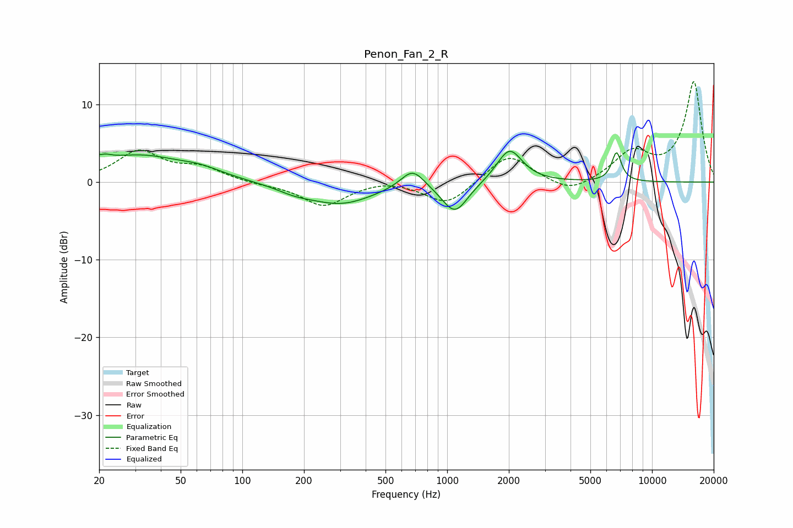

# Penon_Fan_2_R
See [usage instructions](https://github.com/jaakkopasanen/AutoEq#usage) for more options and info.

### Parametric EQs
Apply preamp of -4.1 dB when using parametric equalizer.

|   # | Type    |   Fc (Hz) |    Q |   Gain (dB) |
|-----|---------|-----------|------|-------------|
|   1 | Peaking |        20 | 4.49 |         3.6 |
|   2 | Peaking |        20 | 6    |        -2.4 |
|   3 | Peaking |        31 | 0.67 |         3.3 |
|   4 | Peaking |        63 | 1.31 |         0.9 |
|   5 | Peaking |       180 | 1.61 |        -0.7 |
|   6 | Peaking |       303 | 0.86 |        -2.7 |
|   7 | Peaking |       678 | 2.45 |         2.5 |
|   8 | Peaking |      1091 | 2.21 |        -4   |
|   9 | Peaking |      2014 | 2.27 |         4.4 |
|  10 | Peaking |      6711 | 5.79 |         3.7 |

### Fixed Band EQs
When using fixed band (also called graphic) equalizer, apply preamp of **-13.0 dB** (if available) and set gains manually with these parameters.

|   # | Type    |   Fc (Hz) |    Q |   Gain (dB) |
|-----|---------|-----------|------|-------------|
|   1 | Peaking |        31 | 1.41 |         3.8 |
|   2 | Peaking |        62 | 1.41 |         1.7 |
|   3 | Peaking |       125 | 1.41 |        -0.3 |
|   4 | Peaking |       250 | 1.41 |        -3.1 |
|   5 | Peaking |       500 | 1.41 |         0.5 |
|   6 | Peaking |      1000 | 1.41 |        -3   |
|   7 | Peaking |      2000 | 1.41 |         3.7 |
|   8 | Peaking |      4000 | 1.41 |        -1.7 |
|   9 | Peaking |      8000 | 1.41 |         3.6 |
|  10 | Peaking |     16000 | 1.41 |        12.9 |

### Graphs

