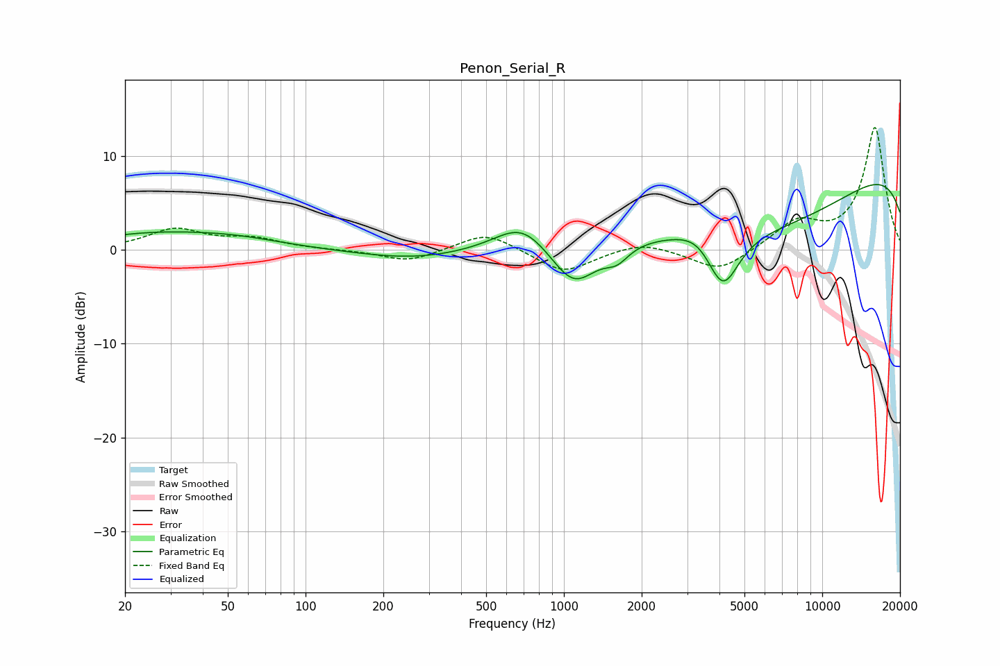

# Penon_Serial_R
See [usage instructions](https://github.com/jaakkopasanen/AutoEq#usage) for more options and info.

### Parametric EQs
Apply preamp of -7.1 dB when using parametric equalizer.

|   # | Type    |   Fc (Hz) |    Q |   Gain (dB) |
|-----|---------|-----------|------|-------------|
|   1 | Peaking |        25 | 0.57 |         1.5 |
|   2 | Peaking |        53 | 0.72 |         0.9 |
|   3 | Peaking |       263 | 0.66 |        -1   |
|   4 | Peaking |       689 | 1.36 |         3.1 |
|   5 | Peaking |      1092 | 1.55 |        -4.9 |
|   6 | Peaking |      1604 | 3.08 |        -1.5 |
|   7 | Peaking |      3332 | 1.9  |         1.3 |
|   8 | Peaking |      4120 | 2.2  |        -6.2 |
|   9 | Peaking |      6826 | 0.32 |        -9   |
|  10 | Peaking |     10000 | 0.18 |        12.6 |

### Fixed Band EQs
When using fixed band (also called graphic) equalizer, apply preamp of **-13.1 dB** (if available) and set gains manually with these parameters.

|   # | Type    |   Fc (Hz) |    Q |   Gain (dB) |
|-----|---------|-----------|------|-------------|
|   1 | Peaking |        31 | 1.41 |         2.1 |
|   2 | Peaking |        62 | 1.41 |         1.1 |
|   3 | Peaking |       125 | 1.41 |        -0   |
|   4 | Peaking |       250 | 1.41 |        -1.3 |
|   5 | Peaking |       500 | 1.41 |         2   |
|   6 | Peaking |      1000 | 1.41 |        -2.5 |
|   7 | Peaking |      2000 | 1.41 |         1   |
|   8 | Peaking |      4000 | 1.41 |        -2.4 |
|   9 | Peaking |      8000 | 1.41 |         2.8 |
|  10 | Peaking |     16000 | 1.41 |        13   |

### Graphs

