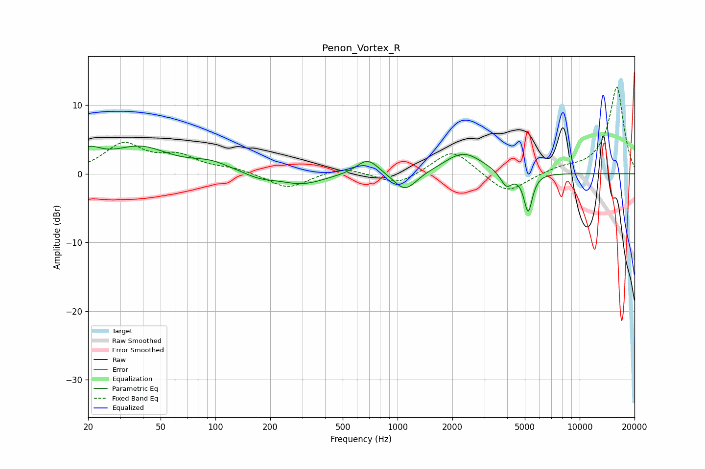

# Penon_Vortex_R
See [usage instructions](https://github.com/jaakkopasanen/AutoEq#usage) for more options and info.

### Parametric EQs
Apply preamp of -4.1 dB when using parametric equalizer.

|   # | Type    |   Fc (Hz) |    Q |   Gain (dB) |
|-----|---------|-----------|------|-------------|
|   1 | Peaking |        20 | 2.01 |         2.5 |
|   2 | Peaking |        39 | 0.89 |         3.6 |
|   3 | Peaking |        94 | 1.27 |         1.3 |
|   4 | Peaking |       175 | 1.69 |        -0.7 |
|   5 | Peaking |       299 | 1.17 |        -1.6 |
|   6 | Peaking |       686 | 2.3  |         2.4 |
|   7 | Peaking |      1101 | 2.23 |        -2.9 |
|   8 | Peaking |      2299 | 1.34 |         3.1 |
|   9 | Peaking |      3954 | 4.27 |        -2.2 |
|  10 | Peaking |      5214 | 6    |        -5.6 |

### Fixed Band EQs
When using fixed band (also called graphic) equalizer, apply preamp of **-12.7 dB** (if available) and set gains manually with these parameters.

|   # | Type    |   Fc (Hz) |    Q |   Gain (dB) |
|-----|---------|-----------|------|-------------|
|   1 | Peaking |        31 | 1.41 |         4.1 |
|   2 | Peaking |        62 | 1.41 |         2.3 |
|   3 | Peaking |       125 | 1.41 |         0.7 |
|   4 | Peaking |       250 | 1.41 |        -2.2 |
|   5 | Peaking |       500 | 1.41 |         1.1 |
|   6 | Peaking |      1000 | 1.41 |        -1.7 |
|   7 | Peaking |      2000 | 1.41 |         3.7 |
|   8 | Peaking |      4000 | 1.41 |        -3.1 |
|   9 | Peaking |      8000 | 1.41 |         0.7 |
|  10 | Peaking |     16000 | 1.41 |        12.7 |

### Graphs

