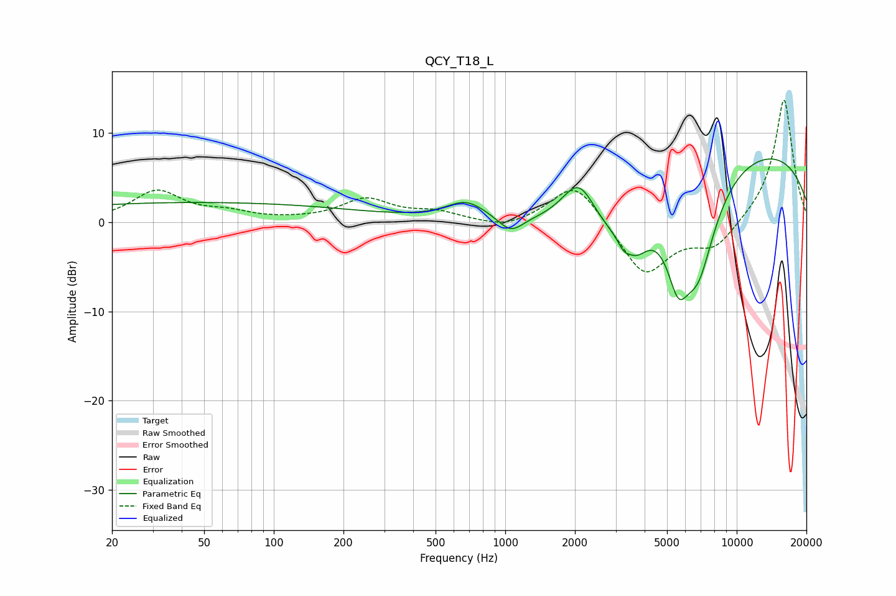

# QCY_T18_L
See [usage instructions](https://github.com/jaakkopasanen/AutoEq#usage) for more options and info.

### Parametric EQs
Apply preamp of -7.2 dB when using parametric equalizer.

|   # | Type    |   Fc (Hz) |    Q |   Gain (dB) |
|-----|---------|-----------|------|-------------|
|   1 | Peaking |        46 | 0.18 |         2.2 |
|   2 | Peaking |       678 | 1.67 |         2   |
|   3 | Peaking |      1057 | 2.6  |        -1.9 |
|   4 | Peaking |      2082 | 1.82 |         5.9 |
|   5 | Peaking |      2823 | 0.62 |        -7.5 |
|   6 | Peaking |      3242 | 5.78 |        -1   |
|   7 | Peaking |      3667 | 2.72 |        -2.7 |
|   8 | Peaking |      5586 | 2.85 |        -6.7 |
|   9 | Peaking |      6816 | 1.63 |       -10.6 |
|  10 | Peaking |      8772 | 0.18 |         9.1 |

### Fixed Band EQs
When using fixed band (also called graphic) equalizer, apply preamp of **-13.8 dB** (if available) and set gains manually with these parameters.

|   # | Type    |   Fc (Hz) |    Q |   Gain (dB) |
|-----|---------|-----------|------|-------------|
|   1 | Peaking |        31 | 1.41 |         3.4 |
|   2 | Peaking |        62 | 1.41 |         0.9 |
|   3 | Peaking |       125 | 1.41 |         0.1 |
|   4 | Peaking |       250 | 1.41 |         2.5 |
|   5 | Peaking |       500 | 1.41 |         1   |
|   6 | Peaking |      1000 | 1.41 |        -0.9 |
|   7 | Peaking |      2000 | 1.41 |         4.7 |
|   8 | Peaking |      4000 | 1.41 |        -6.1 |
|   9 | Peaking |      8000 | 1.41 |        -2.9 |
|  10 | Peaking |     16000 | 1.41 |        14   |

### Graphs

