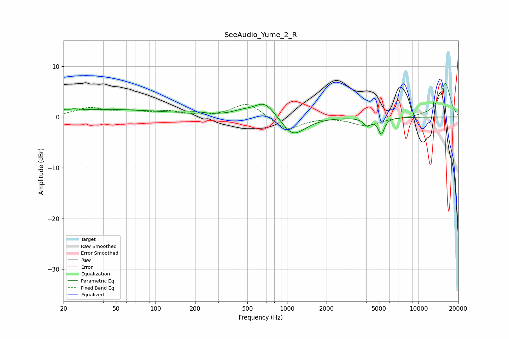

# SeeAudio_Yume_2_R
See [usage instructions](https://github.com/jaakkopasanen/AutoEq#usage) for more options and info.

### Parametric EQs
Apply preamp of -2.6 dB when using parametric equalizer.

|   # | Type    |   Fc (Hz) |    Q |   Gain (dB) |
|-----|---------|-----------|------|-------------|
|   1 | Peaking |        22 | 3.84 |         1.5 |
|   2 | Peaking |        22 | 5.09 |        -1.2 |
|   3 | Peaking |        45 | 0.33 |         1.5 |
|   4 | Peaking |       202 | 2.07 |         0.4 |
|   5 | Peaking |       455 | 1.81 |         0.7 |
|   6 | Peaking |       676 | 1.78 |         3.1 |
|   7 | Peaking |      1090 | 1.78 |        -3.2 |
|   8 | Peaking |      1289 | 1.48 |        -0.9 |
|   9 | Peaking |      4071 | 5.13 |        -1.5 |
|  10 | Peaking |      5212 | 6    |        -3.2 |

### Fixed Band EQs
When using fixed band (also called graphic) equalizer, apply preamp of **-6.7 dB** (if available) and set gains manually with these parameters.

|   # | Type    |   Fc (Hz) |    Q |   Gain (dB) |
|-----|---------|-----------|------|-------------|
|   1 | Peaking |        31 | 1.41 |         1.7 |
|   2 | Peaking |        62 | 1.41 |         0.9 |
|   3 | Peaking |       125 | 1.41 |         1   |
|   4 | Peaking |       250 | 1.41 |        -0   |
|   5 | Peaking |       500 | 1.41 |         2.9 |
|   6 | Peaking |      1000 | 1.41 |        -2.7 |
|   7 | Peaking |      2000 | 1.41 |         0.1 |
|   8 | Peaking |      4000 | 1.41 |        -1.7 |
|   9 | Peaking |      8000 | 1.41 |        -0.2 |
|  10 | Peaking |     16000 | 1.41 |         6.7 |

### Graphs

