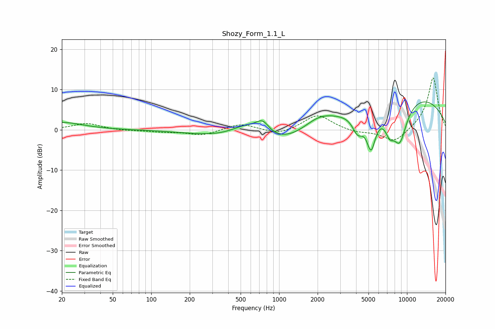

# Shozy_Form_1.1_L
See [usage instructions](https://github.com/jaakkopasanen/AutoEq#usage) for more options and info.

### Parametric EQs
Apply preamp of -7.0 dB when using parametric equalizer.

|   # | Type    |   Fc (Hz) |    Q |   Gain (dB) |
|-----|---------|-----------|------|-------------|
|   1 | Peaking |        20 | 0.89 |         1.8 |
|   2 | Peaking |       566 | 0.98 |         4.9 |
|   3 | Peaking |       744 | 2.78 |         3   |
|   4 | Peaking |       886 | 0.37 |        -5.8 |
|   5 | Peaking |      2035 | 1.07 |         3.7 |
|   6 | Peaking |      4113 | 3.3  |        -4.4 |
|   7 | Peaking |      5237 | 3.63 |        -9.2 |
|   8 | Peaking |      7316 | 3.58 |        -4.2 |
|   9 | Peaking |      8769 | 2.05 |       -10.5 |
|  10 | Peaking |      9631 | 0.27 |         9.3 |

### Fixed Band EQs
When using fixed band (also called graphic) equalizer, apply preamp of **-13.0 dB** (if available) and set gains manually with these parameters.

|   # | Type    |   Fc (Hz) |    Q |   Gain (dB) |
|-----|---------|-----------|------|-------------|
|   1 | Peaking |        31 | 1.41 |         1.6 |
|   2 | Peaking |        62 | 1.41 |        -0.2 |
|   3 | Peaking |       125 | 1.41 |        -0.5 |
|   4 | Peaking |       250 | 1.41 |        -1.4 |
|   5 | Peaking |       500 | 1.41 |         1.6 |
|   6 | Peaking |      1000 | 1.41 |        -1.3 |
|   7 | Peaking |      2000 | 1.41 |         3.8 |
|   8 | Peaking |      4000 | 1.41 |        -0.7 |
|   9 | Peaking |      8000 | 1.41 |        -3.3 |
|  10 | Peaking |     16000 | 1.41 |        13.1 |

### Graphs

