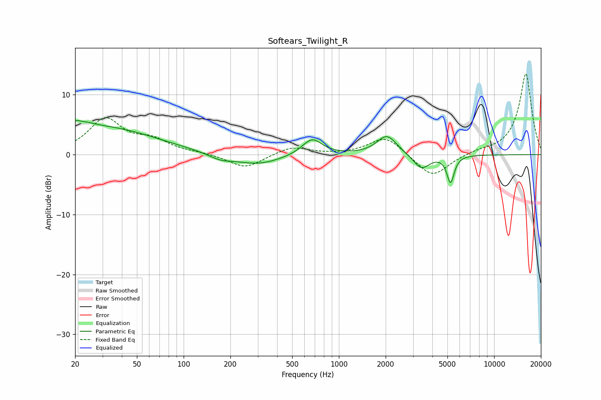

# Softears_Twilight_R
See [usage instructions](https://github.com/jaakkopasanen/AutoEq#usage) for more options and info.

### Parametric EQs
Apply preamp of -5.8 dB when using parametric equalizer.

|   # | Type    |   Fc (Hz) |    Q |   Gain (dB) |
|-----|---------|-----------|------|-------------|
|   1 | Peaking |        20 | 5.99 |        -2.4 |
|   2 | Peaking |        20 | 5.96 |         3.2 |
|   3 | Peaking |        22 | 1.88 |         1.3 |
|   4 | Peaking |        31 | 0.43 |         4.3 |
|   5 | Peaking |       172 | 1.84 |        -0.9 |
|   6 | Peaking |       300 | 0.96 |        -1.7 |
|   7 | Peaking |       672 | 2.22 |         2.8 |
|   8 | Peaking |      2038 | 2.21 |         3.2 |
|   9 | Peaking |      3400 | 2.69 |        -2.5 |
|  10 | Peaking |      5237 | 6    |        -4.5 |

### Fixed Band EQs
When using fixed band (also called graphic) equalizer, apply preamp of **-13.6 dB** (if available) and set gains manually with these parameters.

|   # | Type    |   Fc (Hz) |    Q |   Gain (dB) |
|-----|---------|-----------|------|-------------|
|   1 | Peaking |        31 | 1.41 |         5.8 |
|   2 | Peaking |        62 | 1.41 |         2.1 |
|   3 | Peaking |       125 | 1.41 |         0.2 |
|   4 | Peaking |       250 | 1.41 |        -2.3 |
|   5 | Peaking |       500 | 1.41 |         1.4 |
|   6 | Peaking |      1000 | 1.41 |        -0   |
|   7 | Peaking |      2000 | 1.41 |         3.1 |
|   8 | Peaking |      4000 | 1.41 |        -3.9 |
|   9 | Peaking |      8000 | 1.41 |         0.5 |
|  10 | Peaking |     16000 | 1.41 |        13.6 |

### Graphs

