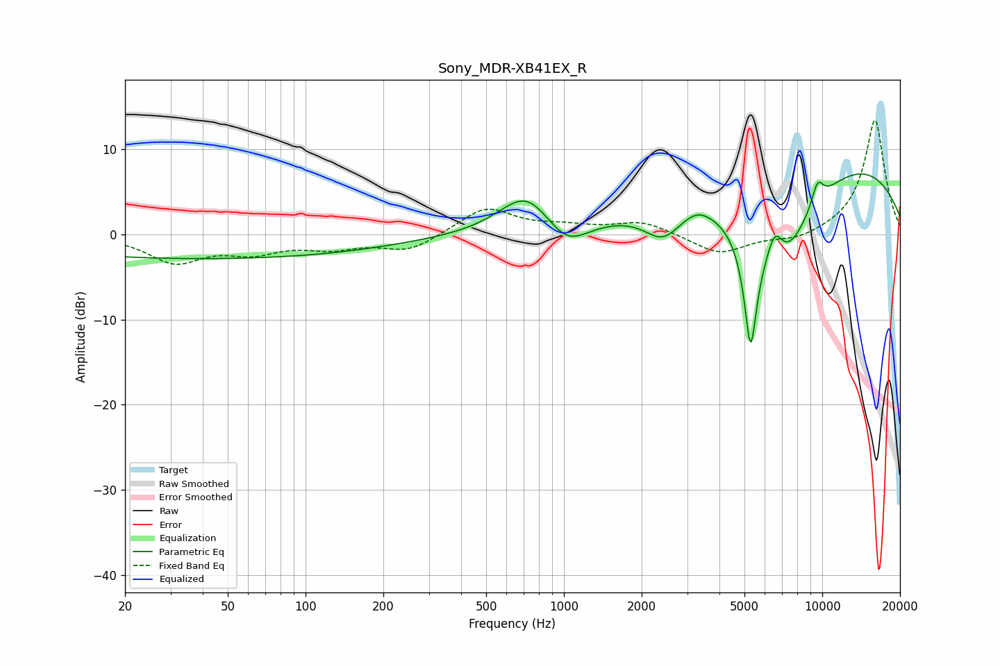

# Sony_MDR-XB41EX_R
See [usage instructions](https://github.com/jaakkopasanen/AutoEq#usage) for more options and info.

### Parametric EQs
Apply preamp of -7.2 dB when using parametric equalizer.

|   # | Type    |   Fc (Hz) |    Q |   Gain (dB) |
|-----|---------|-----------|------|-------------|
|   1 | Peaking |        41 | 0.18 |        -2.9 |
|   2 | Peaking |       716 | 1.36 |         4.9 |
|   3 | Peaking |      1023 | 1.67 |        -3.4 |
|   4 | Peaking |      2417 | 1.95 |        -3.4 |
|   5 | Peaking |      3286 | 2.54 |         1   |
|   6 | Peaking |      5281 | 5.37 |       -13.4 |
|   7 | Peaking |      6556 | 3.93 |         4.6 |
|   8 | Peaking |      6825 | 0.95 |       -13.2 |
|   9 | Peaking |      9317 | 0.24 |        10.7 |
|  10 | Peaking |      9584 | 5.28 |         2.7 |

### Fixed Band EQs
When using fixed band (also called graphic) equalizer, apply preamp of **-13.5 dB** (if available) and set gains manually with these parameters.

|   # | Type    |   Fc (Hz) |    Q |   Gain (dB) |
|-----|---------|-----------|------|-------------|
|   1 | Peaking |        31 | 1.41 |        -3.1 |
|   2 | Peaking |        62 | 1.41 |        -1.8 |
|   3 | Peaking |       125 | 1.41 |        -1.4 |
|   4 | Peaking |       250 | 1.41 |        -1.9 |
|   5 | Peaking |       500 | 1.41 |         3.2 |
|   6 | Peaking |      1000 | 1.41 |         0.7 |
|   7 | Peaking |      2000 | 1.41 |         1.5 |
|   8 | Peaking |      4000 | 1.41 |        -2.4 |
|   9 | Peaking |      8000 | 1.41 |        -0.9 |
|  10 | Peaking |     16000 | 1.41 |        13.5 |

### Graphs

