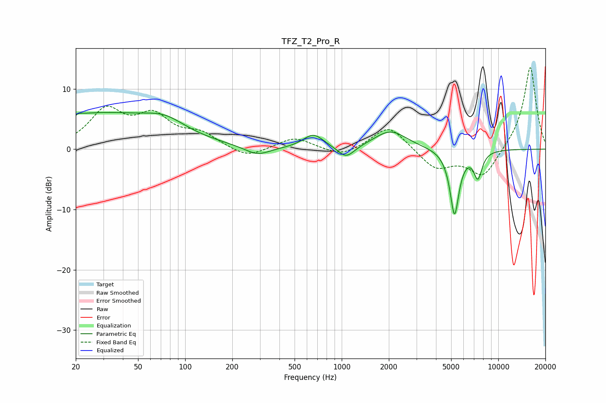

# TFZ_T2_Pro_R
See [usage instructions](https://github.com/jaakkopasanen/AutoEq#usage) for more options and info.

### Parametric EQs
Apply preamp of -6.2 dB when using parametric equalizer.

|   # | Type    |   Fc (Hz) |    Q |   Gain (dB) |
|-----|---------|-----------|------|-------------|
|   1 | Peaking |        20 | 5.98 |        -3.1 |
|   2 | Peaking |        20 | 5.9  |         3   |
|   3 | Peaking |        28 | 0.32 |         5.8 |
|   4 | Peaking |        74 | 1.13 |         2   |
|   5 | Peaking |       289 | 1.75 |        -1.5 |
|   6 | Peaking |       659 | 2.13 |         2.4 |
|   7 | Peaking |      1068 | 2.65 |        -2.1 |
|   8 | Peaking |      2050 | 1.36 |         3   |
|   9 | Peaking |      5255 | 4.69 |       -10.8 |
|  10 | Peaking |      7410 | 5.06 |        -4.3 |

### Fixed Band EQs
When using fixed band (also called graphic) equalizer, apply preamp of **-13.6 dB** (if available) and set gains manually with these parameters.

|   # | Type    |   Fc (Hz) |    Q |   Gain (dB) |
|-----|---------|-----------|------|-------------|
|   1 | Peaking |        31 | 1.41 |         6.1 |
|   2 | Peaking |        62 | 1.41 |         4.9 |
|   3 | Peaking |       125 | 1.41 |         2.2 |
|   4 | Peaking |       250 | 1.41 |        -1.6 |
|   5 | Peaking |       500 | 1.41 |         2   |
|   6 | Peaking |      1000 | 1.41 |        -1.4 |
|   7 | Peaking |      2000 | 1.41 |         4.1 |
|   8 | Peaking |      4000 | 1.41 |        -3.3 |
|   9 | Peaking |      8000 | 1.41 |        -4.8 |
|  10 | Peaking |     16000 | 1.41 |        13.9 |

### Graphs

