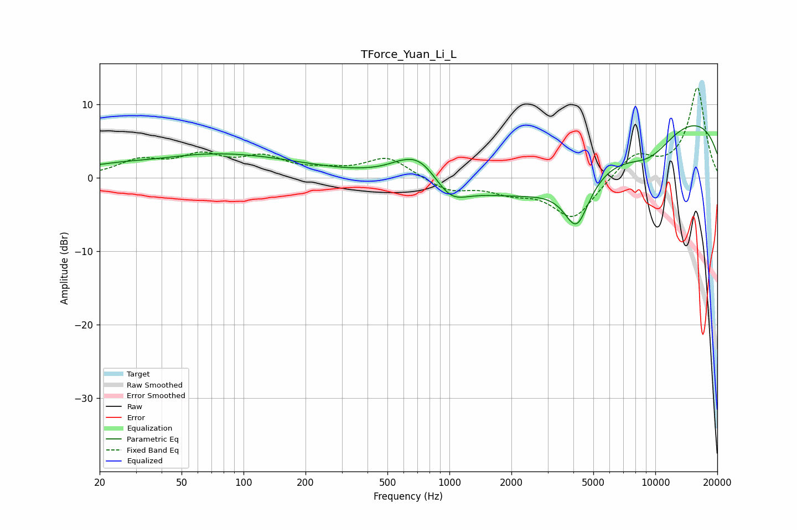

# TForce_Yuan_Li_L
See [usage instructions](https://github.com/jaakkopasanen/AutoEq#usage) for more options and info.

### Parametric EQs
Apply preamp of -7.1 dB when using parametric equalizer.

|   # | Type    |   Fc (Hz) |    Q |   Gain (dB) |
|-----|---------|-----------|------|-------------|
|   1 | Peaking |        39 | 0.98 |        -0.4 |
|   2 | Peaking |        61 | 0.3  |         3.1 |
|   3 | Peaking |        99 | 0.43 |         0.3 |
|   4 | Peaking |       548 | 4.7  |         0.1 |
|   5 | Peaking |       708 | 1.26 |         4.2 |
|   6 | Peaking |      1006 | 1.71 |        -3   |
|   7 | Peaking |      2928 | 0.4  |        -7.1 |
|   8 | Peaking |      4148 | 2.25 |        -6.8 |
|   9 | Peaking |      9346 | 0.96 |        -4   |
|  10 | Peaking |      9948 | 0.18 |         9.6 |

### Fixed Band EQs
When using fixed band (also called graphic) equalizer, apply preamp of **-12.3 dB** (if available) and set gains manually with these parameters.

|   # | Type    |   Fc (Hz) |    Q |   Gain (dB) |
|-----|---------|-----------|------|-------------|
|   1 | Peaking |        31 | 1.41 |         2.1 |
|   2 | Peaking |        62 | 1.41 |         2.6 |
|   3 | Peaking |       125 | 1.41 |         2.4 |
|   4 | Peaking |       250 | 1.41 |         0.7 |
|   5 | Peaking |       500 | 1.41 |         2.8 |
|   6 | Peaking |      1000 | 1.41 |        -1.8 |
|   7 | Peaking |      2000 | 1.41 |        -1.6 |
|   8 | Peaking |      4000 | 1.41 |        -5.6 |
|   9 | Peaking |      8000 | 1.41 |         3.2 |
|  10 | Peaking |     16000 | 1.41 |        12.2 |

### Graphs

