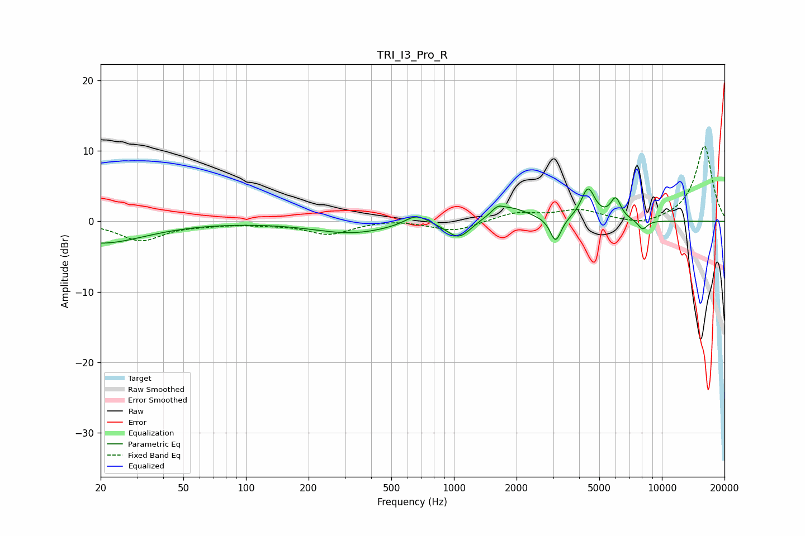

# TRI_I3_Pro_R
See [usage instructions](https://github.com/jaakkopasanen/AutoEq#usage) for more options and info.

### Parametric EQs
Apply preamp of -4.7 dB when using parametric equalizer.

|   # | Type    |   Fc (Hz) |    Q |   Gain (dB) |
|-----|---------|-----------|------|-------------|
|   1 | Peaking |        20 | 0.67 |        -3.1 |
|   2 | Peaking |       322 | 0.76 |        -1.6 |
|   3 | Peaking |       660 | 2.48 |         1.5 |
|   4 | Peaking |      1057 | 2.42 |        -2.6 |
|   5 | Peaking |      1620 | 5.42 |         0.8 |
|   6 | Peaking |      1832 | 1.49 |         2.1 |
|   7 | Peaking |      3083 | 5.37 |        -3.5 |
|   8 | Peaking |      4416 | 4.22 |         4.5 |
|   9 | Peaking |      5997 | 5.54 |         2.9 |
|  10 | Peaking |      8076 | 5.74 |        -1.4 |

### Fixed Band EQs
When using fixed band (also called graphic) equalizer, apply preamp of **-10.8 dB** (if available) and set gains manually with these parameters.

|   # | Type    |   Fc (Hz) |    Q |   Gain (dB) |
|-----|---------|-----------|------|-------------|
|   1 | Peaking |        31 | 1.41 |        -2.7 |
|   2 | Peaking |        62 | 1.41 |        -0.3 |
|   3 | Peaking |       125 | 1.41 |        -0.3 |
|   4 | Peaking |       250 | 1.41 |        -1.8 |
|   5 | Peaking |       500 | 1.41 |         0.3 |
|   6 | Peaking |      1000 | 1.41 |        -1.4 |
|   7 | Peaking |      2000 | 1.41 |         1.2 |
|   8 | Peaking |      4000 | 1.41 |         1.5 |
|   9 | Peaking |      8000 | 1.41 |        -0.8 |
|  10 | Peaking |     16000 | 1.41 |        10.8 |

### Graphs

