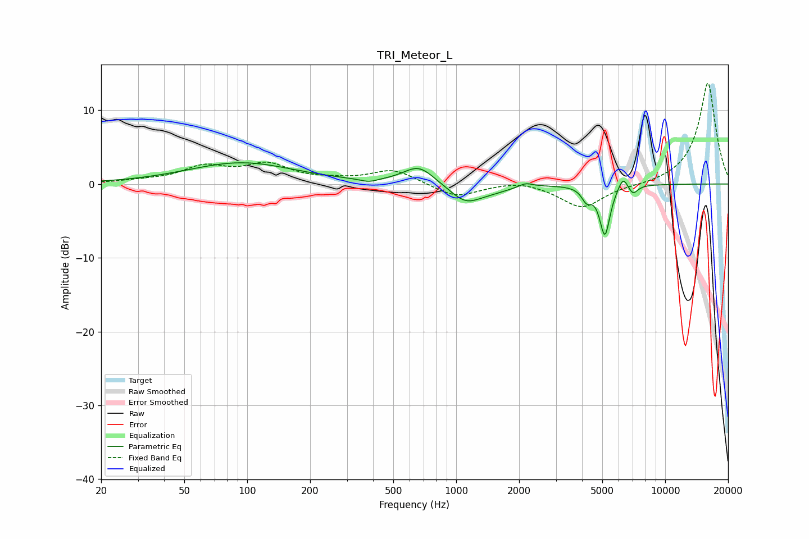

# TRI_Meteor_L
See [usage instructions](https://github.com/jaakkopasanen/AutoEq#usage) for more options and info.

### Parametric EQs
Apply preamp of -3.0 dB when using parametric equalizer.

|   # | Type    |   Fc (Hz) |    Q |   Gain (dB) |
|-----|---------|-----------|------|-------------|
|   1 | Peaking |        94 | 0.56 |         2.9 |
|   2 | Peaking |       382 | 3.5  |        -0.5 |
|   3 | Peaking |       663 | 1.89 |         2.5 |
|   4 | Peaking |      1109 | 1.83 |        -2.4 |
|   5 | Peaking |      1500 | 1.5  |        -0.6 |
|   6 | Peaking |      2149 | 4.24 |         0.6 |
|   7 | Peaking |      4210 | 6    |        -1.7 |
|   8 | Peaking |      5145 | 5.62 |        -6.8 |
|   9 | Peaking |      6291 | 5.96 |         1.8 |
|  10 | Peaking |      7008 | 6    |        -1.2 |

### Fixed Band EQs
When using fixed band (also called graphic) equalizer, apply preamp of **-13.7 dB** (if available) and set gains manually with these parameters.

|   # | Type    |   Fc (Hz) |    Q |   Gain (dB) |
|-----|---------|-----------|------|-------------|
|   1 | Peaking |        31 | 1.41 |         0.3 |
|   2 | Peaking |        62 | 1.41 |         2.2 |
|   3 | Peaking |       125 | 1.41 |         2.4 |
|   4 | Peaking |       250 | 1.41 |         0.4 |
|   5 | Peaking |       500 | 1.41 |         1.9 |
|   6 | Peaking |      1000 | 1.41 |        -1.8 |
|   7 | Peaking |      2000 | 1.41 |         0.6 |
|   8 | Peaking |      4000 | 1.41 |        -3.3 |
|   9 | Peaking |      8000 | 1.41 |        -0.2 |
|  10 | Peaking |     16000 | 1.41 |        13.8 |

### Graphs

