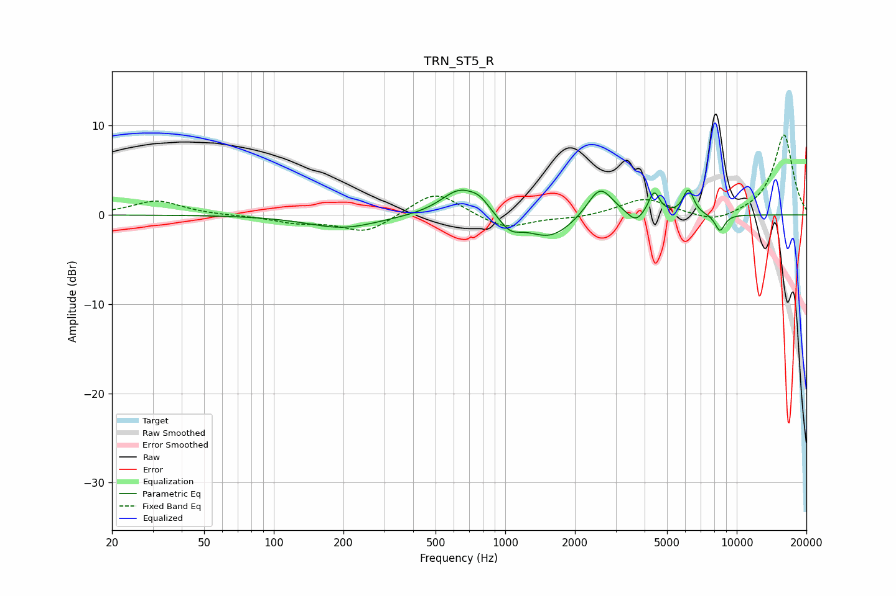

# TRN_ST5_R
See [usage instructions](https://github.com/jaakkopasanen/AutoEq#usage) for more options and info.

### Parametric EQs
Apply preamp of -2.9 dB when using parametric equalizer.

|   # | Type    |   Fc (Hz) |    Q |   Gain (dB) |
|-----|---------|-----------|------|-------------|
|   1 | Peaking |       199 | 0.93 |        -1.5 |
|   2 | Peaking |       637 | 1.71 |         3   |
|   3 | Peaking |       777 | 3.43 |         1   |
|   4 | Peaking |      1050 | 3.03 |        -1.5 |
|   5 | Peaking |      1558 | 1.38 |        -2.7 |
|   6 | Peaking |      2567 | 2.55 |         3.5 |
|   7 | Peaking |      3659 | 4.15 |        -1.2 |
|   8 | Peaking |      4395 | 6    |         2.6 |
|   9 | Peaking |      6184 | 6    |         2.8 |
|  10 | Peaking |      8463 | 6    |        -1.9 |

### Fixed Band EQs
When using fixed band (also called graphic) equalizer, apply preamp of **-9.1 dB** (if available) and set gains manually with these parameters.

|   # | Type    |   Fc (Hz) |    Q |   Gain (dB) |
|-----|---------|-----------|------|-------------|
|   1 | Peaking |        31 | 1.41 |         1.6 |
|   2 | Peaking |        62 | 1.41 |        -0.1 |
|   3 | Peaking |       125 | 1.41 |        -0.8 |
|   4 | Peaking |       250 | 1.41 |        -2   |
|   5 | Peaking |       500 | 1.41 |         2.8 |
|   6 | Peaking |      1000 | 1.41 |        -1.6 |
|   7 | Peaking |      2000 | 1.41 |        -0.3 |
|   8 | Peaking |      4000 | 1.41 |         1.9 |
|   9 | Peaking |      8000 | 1.41 |        -1   |
|  10 | Peaking |     16000 | 1.41 |         9.1 |

### Graphs

