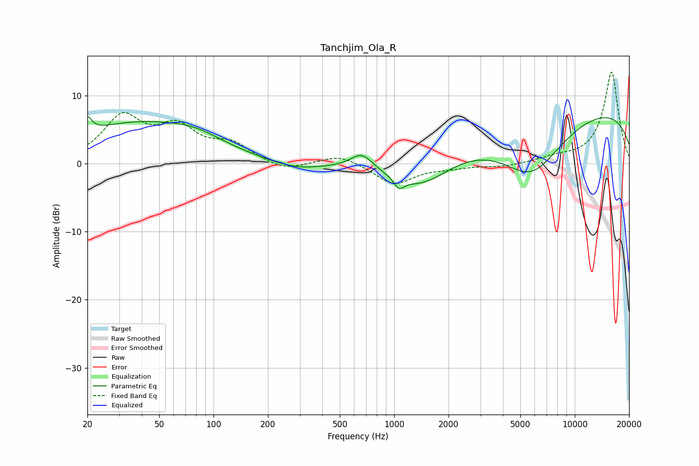

# Tanchjim_Ola_R
See [usage instructions](https://github.com/jaakkopasanen/AutoEq#usage) for more options and info.

### Parametric EQs
Apply preamp of -7.0 dB when using parametric equalizer.

|   # | Type    |   Fc (Hz) |    Q |   Gain (dB) |
|-----|---------|-----------|------|-------------|
|   1 | Peaking |        20 | 5.92 |         2.2 |
|   2 | Peaking |        37 | 0.39 |         5.7 |
|   3 | Peaking |        79 | 0.95 |         1.4 |
|   4 | Peaking |       285 | 0.98 |        -1.1 |
|   5 | Peaking |       653 | 2.38 |         1.9 |
|   6 | Peaking |       688 | 2.72 |         0.4 |
|   7 | Peaking |      1063 | 5.24 |        -1.5 |
|   8 | Peaking |      1411 | 0.83 |        -4.6 |
|   9 | Peaking |      5760 | 0.76 |        -8.7 |
|  10 | Peaking |      9802 | 0.18 |         8.6 |

### Fixed Band EQs
When using fixed band (also called graphic) equalizer, apply preamp of **-13.5 dB** (if available) and set gains manually with these parameters.

|   # | Type    |   Fc (Hz) |    Q |   Gain (dB) |
|-----|---------|-----------|------|-------------|
|   1 | Peaking |        31 | 1.41 |         6.5 |
|   2 | Peaking |        62 | 1.41 |         4.7 |
|   3 | Peaking |       125 | 1.41 |         2.5 |
|   4 | Peaking |       250 | 1.41 |        -1.2 |
|   5 | Peaking |       500 | 1.41 |         1.4 |
|   6 | Peaking |      1000 | 1.41 |        -3.1 |
|   7 | Peaking |      2000 | 1.41 |        -0.5 |
|   8 | Peaking |      4000 | 1.41 |        -0.5 |
|   9 | Peaking |      8000 | 1.41 |         0.7 |
|  10 | Peaking |     16000 | 1.41 |        13.5 |

### Graphs

