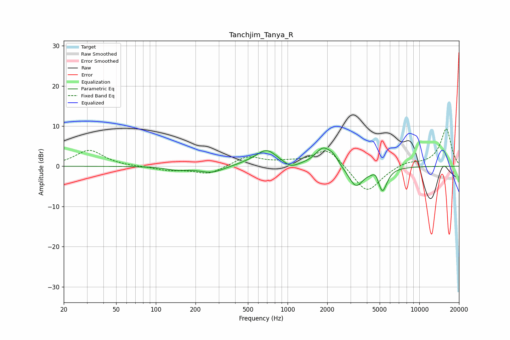

# Tanchjim_Tanya_R
See [usage instructions](https://github.com/jaakkopasanen/AutoEq#usage) for more options and info.

### Parametric EQs
Apply preamp of -4.6 dB when using parametric equalizer.

|   # | Type    |   Fc (Hz) |    Q |   Gain (dB) |
|-----|---------|-----------|------|-------------|
|   1 | Peaking |       143 | 1.91 |        -0.8 |
|   2 | Peaking |       264 | 1.45 |        -1.7 |
|   3 | Peaking |       553 | 1.17 |         0.8 |
|   4 | Peaking |       697 | 1.89 |         3.5 |
|   5 | Peaking |      1060 | 2.84 |        -1.3 |
|   6 | Peaking |      1865 | 2.36 |         4.5 |
|   7 | Peaking |      2226 | 4.02 |         1.6 |
|   8 | Peaking |      3299 | 2.55 |        -5.1 |
|   9 | Peaking |      4680 | 5.9  |         1.5 |
|  10 | Peaking |      5241 | 3.95 |        -6   |

### Fixed Band EQs
When using fixed band (also called graphic) equalizer, apply preamp of **-9.4 dB** (if available) and set gains manually with these parameters.

|   # | Type    |   Fc (Hz) |    Q |   Gain (dB) |
|-----|---------|-----------|------|-------------|
|   1 | Peaking |        31 | 1.41 |         4   |
|   2 | Peaking |        62 | 1.41 |        -0.1 |
|   3 | Peaking |       125 | 1.41 |        -0.9 |
|   4 | Peaking |       250 | 1.41 |        -2   |
|   5 | Peaking |       500 | 1.41 |         2.4 |
|   6 | Peaking |      1000 | 1.41 |         0.7 |
|   7 | Peaking |      2000 | 1.41 |         4.6 |
|   8 | Peaking |      4000 | 1.41 |        -6.8 |
|   9 | Peaking |      8000 | 1.41 |         1.1 |
|  10 | Peaking |     16000 | 1.41 |         9.4 |

### Graphs

