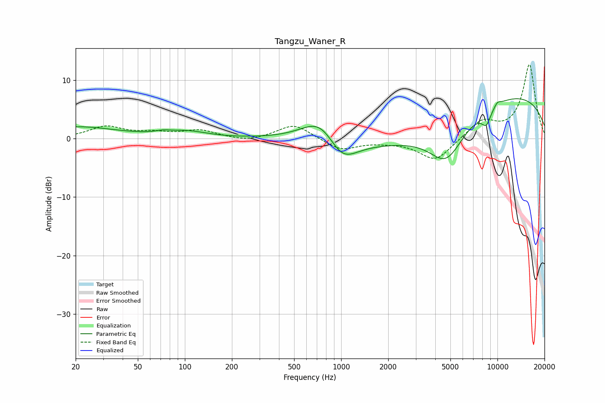

# Tangzu_Waner_R
See [usage instructions](https://github.com/jaakkopasanen/AutoEq#usage) for more options and info.

### Parametric EQs
Apply preamp of -6.9 dB when using parametric equalizer.

|   # | Type    |   Fc (Hz) |    Q |   Gain (dB) |
|-----|---------|-----------|------|-------------|
|   1 | Peaking |        20 | 0.55 |         2   |
|   2 | Peaking |        72 | 3.2  |         0.3 |
|   3 | Peaking |       102 | 1.06 |         1.1 |
|   4 | Peaking |       745 | 1.19 |         4.8 |
|   5 | Peaking |      1006 | 1.45 |        -4.6 |
|   6 | Peaking |      4718 | 1.24 |        -6.8 |
|   7 | Peaking |      5295 | 0.25 |        -6.1 |
|   8 | Peaking |      8482 | 4.23 |        -2.6 |
|   9 | Peaking |      9448 | 0.25 |        12.2 |
|  10 | Peaking |     10000 | 5.96 |         0.7 |

### Fixed Band EQs
When using fixed band (also called graphic) equalizer, apply preamp of **-12.8 dB** (if available) and set gains manually with these parameters.

|   # | Type    |   Fc (Hz) |    Q |   Gain (dB) |
|-----|---------|-----------|------|-------------|
|   1 | Peaking |        31 | 1.41 |         2   |
|   2 | Peaking |        62 | 1.41 |         0.8 |
|   3 | Peaking |       125 | 1.41 |         1.3 |
|   4 | Peaking |       250 | 1.41 |        -0.6 |
|   5 | Peaking |       500 | 1.41 |         2.5 |
|   6 | Peaking |      1000 | 1.41 |        -2   |
|   7 | Peaking |      2000 | 1.41 |        -0.3 |
|   8 | Peaking |      4000 | 1.41 |        -3.8 |
|   9 | Peaking |      8000 | 1.41 |         3   |
|  10 | Peaking |     16000 | 1.41 |        12.7 |

### Graphs

