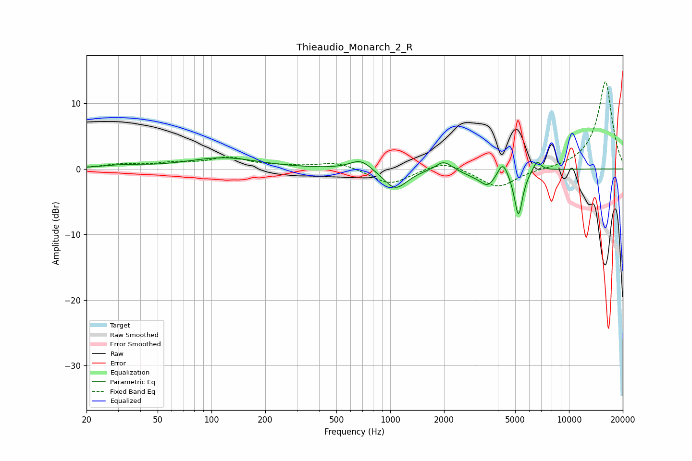

# Thieaudio_Monarch_2_R
See [usage instructions](https://github.com/jaakkopasanen/AutoEq#usage) for more options and info.

### Parametric EQs
Apply preamp of -1.8 dB when using parametric equalizer.

|   # | Type    |   Fc (Hz) |    Q |   Gain (dB) |
|-----|---------|-----------|------|-------------|
|   1 | Peaking |        32 | 1.25 |         0.4 |
|   2 | Peaking |       116 | 0.72 |         1.7 |
|   3 | Peaking |       683 | 2.37 |         1.6 |
|   4 | Peaking |      1068 | 2.18 |        -3.1 |
|   5 | Peaking |      1990 | 3.17 |         1.5 |
|   6 | Peaking |      2933 | 2.05 |        -0.7 |
|   7 | Peaking |      3522 | 3.35 |        -2.1 |
|   8 | Peaking |      4259 | 5.28 |         2.2 |
|   9 | Peaking |      5218 | 6    |        -7.1 |
|  10 | Peaking |      6624 | 5.97 |         1.7 |

### Fixed Band EQs
When using fixed band (also called graphic) equalizer, apply preamp of **-13.4 dB** (if available) and set gains manually with these parameters.

|   # | Type    |   Fc (Hz) |    Q |   Gain (dB) |
|-----|---------|-----------|------|-------------|
|   1 | Peaking |        31 | 1.41 |         0.6 |
|   2 | Peaking |        62 | 1.41 |         0.8 |
|   3 | Peaking |       125 | 1.41 |         1.6 |
|   4 | Peaking |       250 | 1.41 |         0.3 |
|   5 | Peaking |       500 | 1.41 |         1.1 |
|   6 | Peaking |      1000 | 1.41 |        -2.4 |
|   7 | Peaking |      2000 | 1.41 |         1.4 |
|   8 | Peaking |      4000 | 1.41 |        -2.9 |
|   9 | Peaking |      8000 | 1.41 |        -0.1 |
|  10 | Peaking |     16000 | 1.41 |        13.4 |

### Graphs

