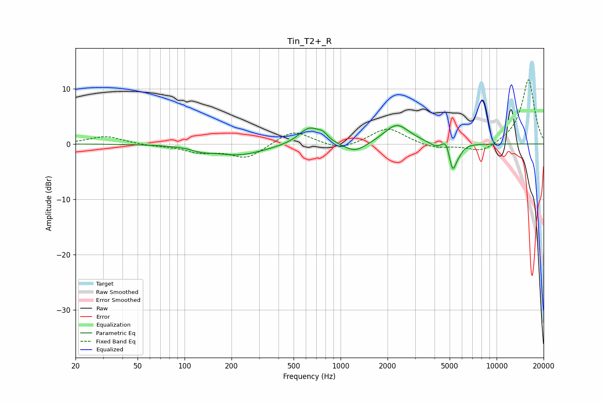

# Tin_T2+_R
See [usage instructions](https://github.com/jaakkopasanen/AutoEq#usage) for more options and info.

### Parametric EQs
Apply preamp of -3.4 dB when using parametric equalizer.

|   # | Type    |   Fc (Hz) |    Q |   Gain (dB) |
|-----|---------|-----------|------|-------------|
|   1 | Peaking |       129 | 2.33 |        -0.6 |
|   2 | Peaking |       222 | 0.85 |        -2   |
|   3 | Peaking |       631 | 2.06 |         3.1 |
|   4 | Peaking |       768 | 4.7  |         1   |
|   5 | Peaking |      1237 | 1.91 |        -1.8 |
|   6 | Peaking |      2293 | 1.74 |         3.6 |
|   7 | Peaking |      4056 | 3.63 |        -0.8 |
|   8 | Peaking |      4739 | 6    |         1.6 |
|   9 | Peaking |      5228 | 6    |        -4.7 |
|  10 | Peaking |      5748 | 5.49 |        -0.9 |

### Fixed Band EQs
When using fixed band (also called graphic) equalizer, apply preamp of **-11.7 dB** (if available) and set gains manually with these parameters.

|   # | Type    |   Fc (Hz) |    Q |   Gain (dB) |
|-----|---------|-----------|------|-------------|
|   1 | Peaking |        31 | 1.41 |         1.4 |
|   2 | Peaking |        62 | 1.41 |        -0.3 |
|   3 | Peaking |       125 | 1.41 |        -1.3 |
|   4 | Peaking |       250 | 1.41 |        -2.6 |
|   5 | Peaking |       500 | 1.41 |         2.6 |
|   6 | Peaking |      1000 | 1.41 |        -1.2 |
|   7 | Peaking |      2000 | 1.41 |         3   |
|   8 | Peaking |      4000 | 1.41 |        -0.9 |
|   9 | Peaking |      8000 | 1.41 |        -1.7 |
|  10 | Peaking |     16000 | 1.41 |        11.8 |

### Graphs

