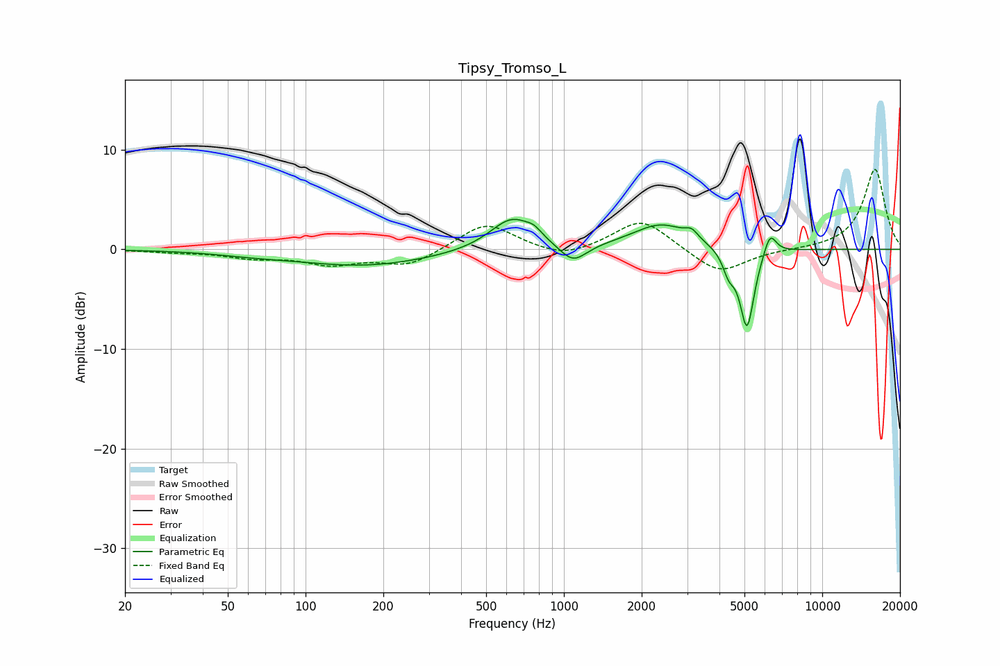

# Tipsy_Tromso_L
See [usage instructions](https://github.com/jaakkopasanen/AutoEq#usage) for more options and info.

### Parametric EQs
Apply preamp of -3.1 dB when using parametric equalizer.

|   # | Type    |   Fc (Hz) |    Q |   Gain (dB) |
|-----|---------|-----------|------|-------------|
|   1 | Peaking |        62 | 1.06 |        -0.3 |
|   2 | Peaking |       168 | 0.53 |        -1.6 |
|   3 | Peaking |       632 | 1.64 |         3.3 |
|   4 | Peaking |       767 | 5.01 |         0.6 |
|   5 | Peaking |      1084 | 2.66 |        -1.9 |
|   6 | Peaking |      2386 | 1.26 |         2.5 |
|   7 | Peaking |      3120 | 6    |         0.8 |
|   8 | Peaking |      4349 | 5.99 |        -1.9 |
|   9 | Peaking |      5114 | 4.97 |        -8.1 |
|  10 | Peaking |      6274 | 5.63 |         2.3 |

### Fixed Band EQs
When using fixed band (also called graphic) equalizer, apply preamp of **-8.1 dB** (if available) and set gains manually with these parameters.

|   # | Type    |   Fc (Hz) |    Q |   Gain (dB) |
|-----|---------|-----------|------|-------------|
|   1 | Peaking |        31 | 1.41 |        -0.2 |
|   2 | Peaking |        62 | 1.41 |        -0.7 |
|   3 | Peaking |       125 | 1.41 |        -1.3 |
|   4 | Peaking |       250 | 1.41 |        -1.6 |
|   5 | Peaking |       500 | 1.41 |         2.7 |
|   6 | Peaking |      1000 | 1.41 |        -1   |
|   7 | Peaking |      2000 | 1.41 |         3.1 |
|   8 | Peaking |      4000 | 1.41 |        -2.5 |
|   9 | Peaking |      8000 | 1.41 |        -0   |
|  10 | Peaking |     16000 | 1.41 |         8.1 |

### Graphs

