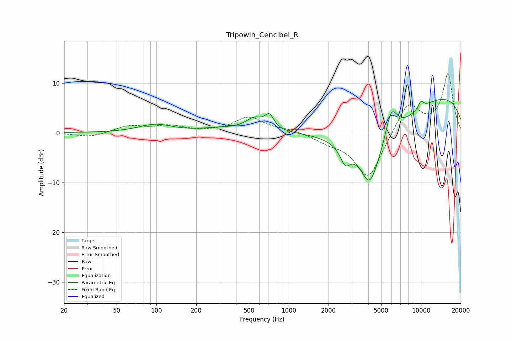

# Tripowin_Cencibel_R
See [usage instructions](https://github.com/jaakkopasanen/AutoEq#usage) for more options and info.

### Parametric EQs
Apply preamp of -6.8 dB when using parametric equalizer.

|   # | Type    |   Fc (Hz) |    Q |   Gain (dB) |
|-----|---------|-----------|------|-------------|
|   1 | Peaking |        98 | 1.13 |         1.6 |
|   2 | Peaking |       302 | 0.98 |         0.7 |
|   3 | Peaking |       550 | 2.11 |         2.4 |
|   4 | Peaking |       714 | 4.24 |         2.7 |
|   5 | Peaking |      2674 | 3.74 |        -3.3 |
|   6 | Peaking |      4071 | 2.61 |        -4.9 |
|   7 | Peaking |      4473 | 0.66 |       -12.6 |
|   8 | Peaking |      5949 | 2.73 |         7.1 |
|   9 | Peaking |     10000 | 0.2  |         8.8 |
|  10 | Peaking |     10000 | 6    |         1.5 |

### Fixed Band EQs
When using fixed band (also called graphic) equalizer, apply preamp of **-12.0 dB** (if available) and set gains manually with these parameters.

|   # | Type    |   Fc (Hz) |    Q |   Gain (dB) |
|-----|---------|-----------|------|-------------|
|   1 | Peaking |        31 | 1.41 |        -0.9 |
|   2 | Peaking |        62 | 1.41 |         1.3 |
|   3 | Peaking |       125 | 1.41 |         1.3 |
|   4 | Peaking |       250 | 1.41 |         0.1 |
|   5 | Peaking |       500 | 1.41 |         3.1 |
|   6 | Peaking |      1000 | 1.41 |         0.6 |
|   7 | Peaking |      2000 | 1.41 |        -1.3 |
|   8 | Peaking |      4000 | 1.41 |        -9.4 |
|   9 | Peaking |      8000 | 1.41 |         6.3 |
|  10 | Peaking |     16000 | 1.41 |        11.7 |

### Graphs

