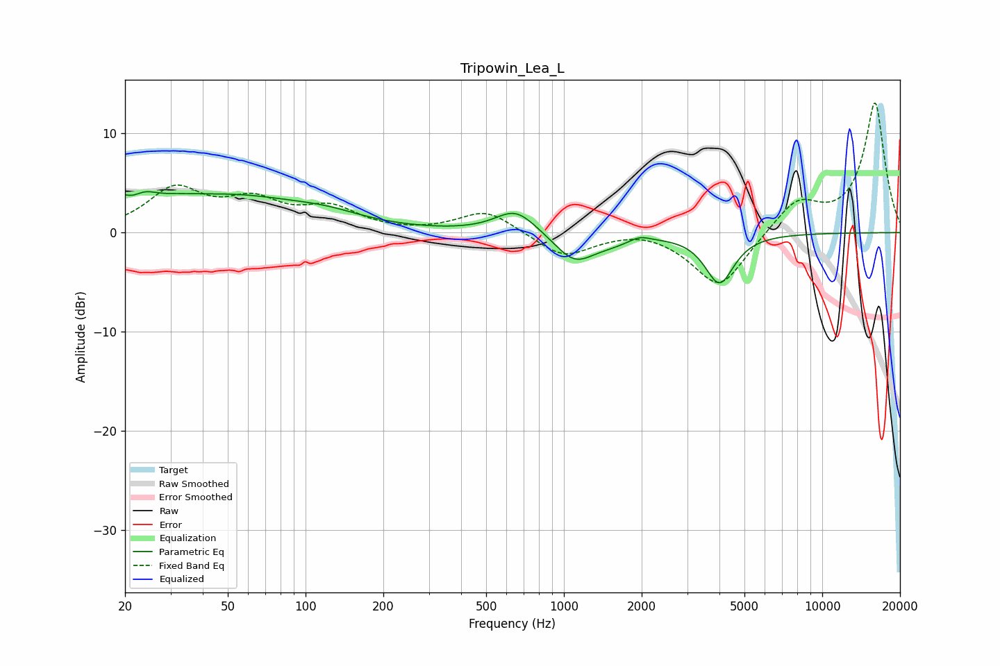

# Tripowin_Lea_L
See [usage instructions](https://github.com/jaakkopasanen/AutoEq#usage) for more options and info.

### Parametric EQs
Apply preamp of -4.2 dB when using parametric equalizer.

|   # | Type    |   Fc (Hz) |    Q |   Gain (dB) |
|-----|---------|-----------|------|-------------|
|   1 | Peaking |        21 | 3.22 |        -1.7 |
|   2 | Peaking |        21 | 1.33 |         4   |
|   3 | Peaking |        27 | 2.69 |        -0.6 |
|   4 | Peaking |        54 | 0.48 |         3.3 |
|   5 | Peaking |       121 | 1.06 |         0.7 |
|   6 | Peaking |       651 | 1.78 |         2.4 |
|   7 | Peaking |      1098 | 1.86 |        -2.8 |
|   8 | Peaking |      1536 | 1.47 |        -0.7 |
|   9 | Peaking |      1961 | 3.51 |         0.6 |
|  10 | Peaking |      4001 | 2.53 |        -5   |

### Fixed Band EQs
When using fixed band (also called graphic) equalizer, apply preamp of **-13.2 dB** (if available) and set gains manually with these parameters.

|   # | Type    |   Fc (Hz) |    Q |   Gain (dB) |
|-----|---------|-----------|------|-------------|
|   1 | Peaking |        31 | 1.41 |         4.2 |
|   2 | Peaking |        62 | 1.41 |         2.8 |
|   3 | Peaking |       125 | 1.41 |         2.2 |
|   4 | Peaking |       250 | 1.41 |        -0.1 |
|   5 | Peaking |       500 | 1.41 |         2.3 |
|   6 | Peaking |      1000 | 1.41 |        -2.5 |
|   7 | Peaking |      2000 | 1.41 |         0.5 |
|   8 | Peaking |      4000 | 1.41 |        -5.7 |
|   9 | Peaking |      8000 | 1.41 |         3.2 |
|  10 | Peaking |     16000 | 1.41 |        13.1 |

### Graphs

