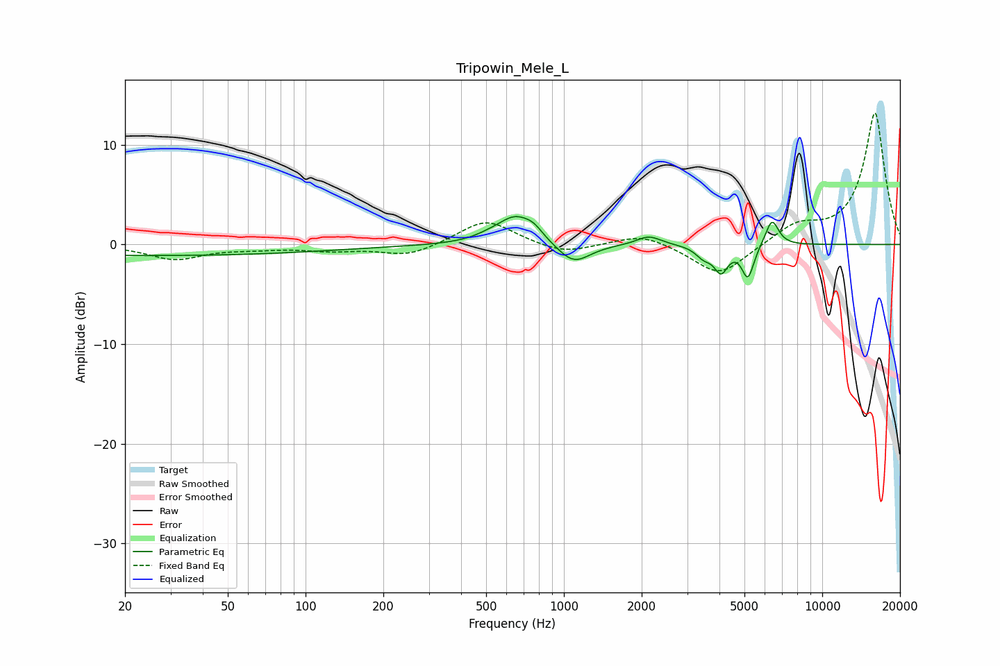

# Tripowin_Mele_L
See [usage instructions](https://github.com/jaakkopasanen/AutoEq#usage) for more options and info.

### Parametric EQs
Apply preamp of -2.9 dB when using parametric equalizer.

|   # | Type    |   Fc (Hz) |    Q |   Gain (dB) |
|-----|---------|-----------|------|-------------|
|   1 | Peaking |        25 | 0.18 |        -1.1 |
|   2 | Peaking |       513 | 2.2  |         0.4 |
|   3 | Peaking |       650 | 2.02 |         2.7 |
|   4 | Peaking |       766 | 3.87 |         0.8 |
|   5 | Peaking |      1091 | 2.23 |        -2.1 |
|   6 | Peaking |      2132 | 3.01 |         0.9 |
|   7 | Peaking |      3476 | 4.54 |        -1   |
|   8 | Peaking |      4060 | 5.29 |        -2.5 |
|   9 | Peaking |      5155 | 6    |        -3.3 |
|  10 | Peaking |      6387 | 5.39 |         2.7 |

### Fixed Band EQs
When using fixed band (also called graphic) equalizer, apply preamp of **-13.3 dB** (if available) and set gains manually with these parameters.

|   # | Type    |   Fc (Hz) |    Q |   Gain (dB) |
|-----|---------|-----------|------|-------------|
|   1 | Peaking |        31 | 1.41 |        -1.4 |
|   2 | Peaking |        62 | 1.41 |        -0.3 |
|   3 | Peaking |       125 | 1.41 |        -0.5 |
|   4 | Peaking |       250 | 1.41 |        -1.2 |
|   5 | Peaking |       500 | 1.41 |         2.6 |
|   6 | Peaking |      1000 | 1.41 |        -1   |
|   7 | Peaking |      2000 | 1.41 |         1.1 |
|   8 | Peaking |      4000 | 1.41 |        -3.2 |
|   9 | Peaking |      8000 | 1.41 |         1.8 |
|  10 | Peaking |     16000 | 1.41 |        13.2 |

### Graphs

