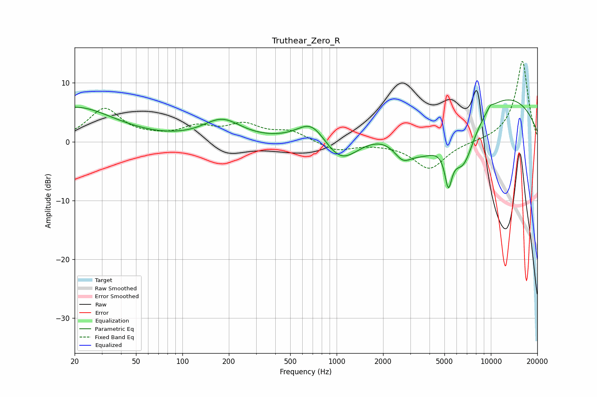

# Truthear_Zero_R
See [usage instructions](https://github.com/jaakkopasanen/AutoEq#usage) for more options and info.

### Parametric EQs
Apply preamp of -7.2 dB when using parametric equalizer.

|   # | Type    |   Fc (Hz) |    Q |   Gain (dB) |
|-----|---------|-----------|------|-------------|
|   1 | Peaking |        20 | 0.55 |         5.8 |
|   2 | Peaking |       181 | 1.15 |         3.5 |
|   3 | Peaking |       690 | 1.49 |         3.9 |
|   4 | Peaking |      1065 | 1.2  |        -4.9 |
|   5 | Peaking |      2680 | 2.34 |        -3   |
|   6 | Peaking |      3676 | 0.98 |        -6.2 |
|   7 | Peaking |      5298 | 5.95 |        -6.1 |
|   8 | Peaking |      6611 | 1.5  |        -9.9 |
|   9 | Peaking |      8605 | 0.23 |         9.3 |
|  10 | Peaking |      9910 | 5.87 |         0.7 |

### Fixed Band EQs
When using fixed band (also called graphic) equalizer, apply preamp of **-13.8 dB** (if available) and set gains manually with these parameters.

|   # | Type    |   Fc (Hz) |    Q |   Gain (dB) |
|-----|---------|-----------|------|-------------|
|   1 | Peaking |        31 | 1.41 |         5.5 |
|   2 | Peaking |        62 | 1.41 |         0.4 |
|   3 | Peaking |       125 | 1.41 |         2.2 |
|   4 | Peaking |       250 | 1.41 |         2.6 |
|   5 | Peaking |       500 | 1.41 |         1.7 |
|   6 | Peaking |      1000 | 1.41 |        -1.6 |
|   7 | Peaking |      2000 | 1.41 |        -0.1 |
|   8 | Peaking |      4000 | 1.41 |        -4.6 |
|   9 | Peaking |      8000 | 1.41 |        -0.1 |
|  10 | Peaking |     16000 | 1.41 |        13.8 |

### Graphs

