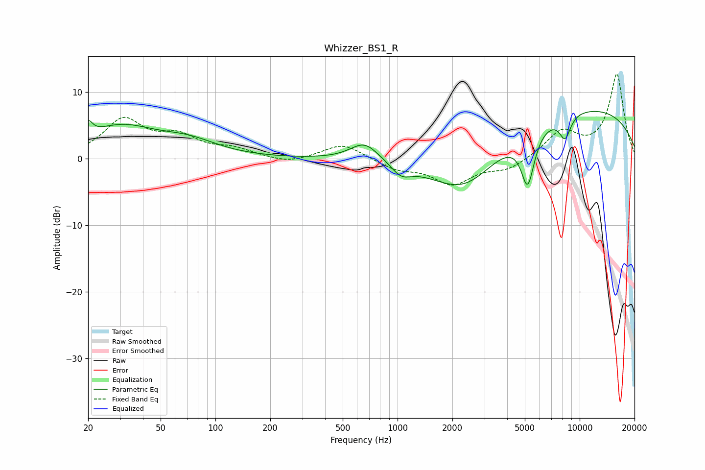

# Whizzer_BS1_R
See [usage instructions](https://github.com/jaakkopasanen/AutoEq#usage) for more options and info.

### Parametric EQs
Apply preamp of -7.2 dB when using parametric equalizer.

|   # | Type    |   Fc (Hz) |    Q |   Gain (dB) |
|-----|---------|-----------|------|-------------|
|   1 | Peaking |        20 | 6    |         2.1 |
|   2 | Peaking |        30 | 0.72 |         4.5 |
|   3 | Peaking |        71 | 0.88 |         2   |
|   4 | Peaking |       660 | 1.78 |         2.8 |
|   5 | Peaking |      1047 | 2.57 |        -1.8 |
|   6 | Peaking |      2342 | 0.7  |        -7.9 |
|   7 | Peaking |      5185 | 3.75 |        -8   |
|   8 | Peaking |      8311 | 4.16 |        -3.5 |
|   9 | Peaking |      9032 | 0.21 |         8   |
|  10 | Peaking |      9856 | 5.95 |         0   |

### Fixed Band EQs
When using fixed band (also called graphic) equalizer, apply preamp of **-12.8 dB** (if available) and set gains manually with these parameters.

|   # | Type    |   Fc (Hz) |    Q |   Gain (dB) |
|-----|---------|-----------|------|-------------|
|   1 | Peaking |        31 | 1.41 |         5.6 |
|   2 | Peaking |        62 | 1.41 |         2.8 |
|   3 | Peaking |       125 | 1.41 |         1.3 |
|   4 | Peaking |       250 | 1.41 |        -0.8 |
|   5 | Peaking |       500 | 1.41 |         2.3 |
|   6 | Peaking |      1000 | 1.41 |        -1.5 |
|   7 | Peaking |      2000 | 1.41 |        -3.6 |
|   8 | Peaking |      4000 | 1.41 |        -1.6 |
|   9 | Peaking |      8000 | 1.41 |         3.9 |
|  10 | Peaking |     16000 | 1.41 |        12.6 |

### Graphs

