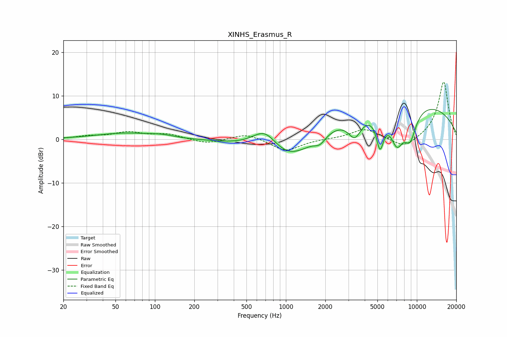

# XINHS_Erasmus_R
See [usage instructions](https://github.com/jaakkopasanen/AutoEq#usage) for more options and info.

### Parametric EQs
Apply preamp of -7.0 dB when using parametric equalizer.

|   # | Type    |   Fc (Hz) |    Q |   Gain (dB) |
|-----|---------|-----------|------|-------------|
|   1 | Peaking |        60 | 0.61 |         1.4 |
|   2 | Peaking |       114 | 1.72 |         0.5 |
|   3 | Peaking |       696 | 1.35 |         5.8 |
|   4 | Peaking |      1018 | 0.65 |        -7.7 |
|   5 | Peaking |      1819 | 3.28 |        -1.8 |
|   6 | Peaking |      3356 | 2.76 |        -4.8 |
|   7 | Peaking |      5229 | 4.77 |        -7.4 |
|   8 | Peaking |      7045 | 2.57 |        -7.6 |
|   9 | Peaking |      7544 | 0.2  |         9.2 |
|  10 | Peaking |      8872 | 2.56 |        -6.8 |

### Fixed Band EQs
When using fixed band (also called graphic) equalizer, apply preamp of **-13.3 dB** (if available) and set gains manually with these parameters.

|   # | Type    |   Fc (Hz) |    Q |   Gain (dB) |
|-----|---------|-----------|------|-------------|
|   1 | Peaking |        31 | 1.41 |         0.6 |
|   2 | Peaking |        62 | 1.41 |         1.5 |
|   3 | Peaking |       125 | 1.41 |         1.1 |
|   4 | Peaking |       250 | 1.41 |        -1   |
|   5 | Peaking |       500 | 1.41 |         1.4 |
|   6 | Peaking |      1000 | 1.41 |        -2.7 |
|   7 | Peaking |      2000 | 1.41 |         0.1 |
|   8 | Peaking |      4000 | 1.41 |         2.5 |
|   9 | Peaking |      8000 | 1.41 |        -2.3 |
|  10 | Peaking |     16000 | 1.41 |        13.4 |

### Graphs

